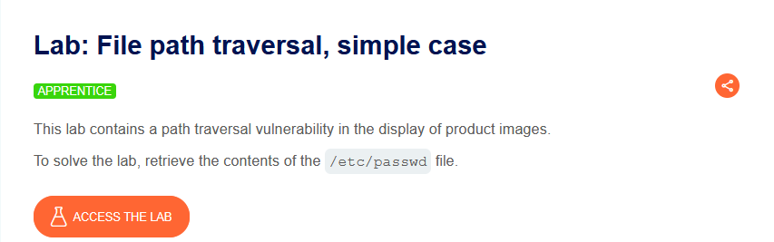
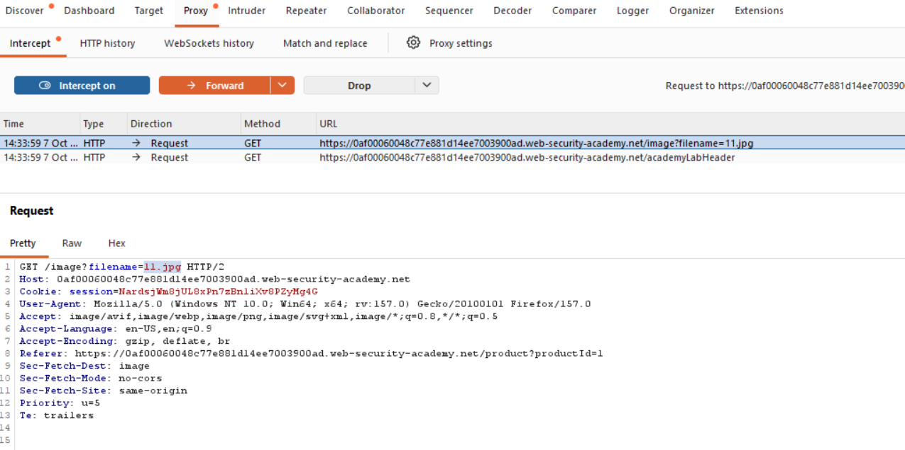
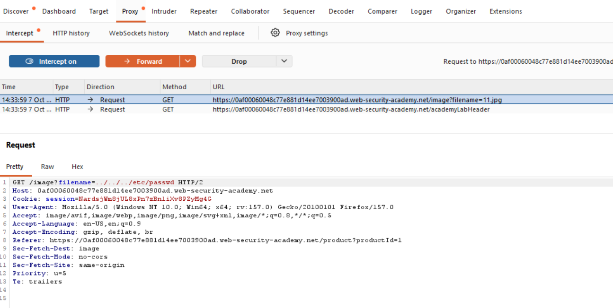
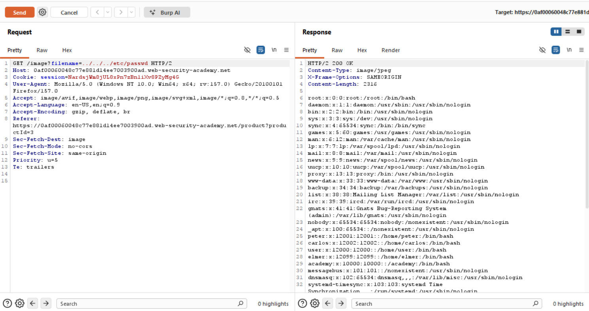

# Path Traversal — Basit Durum (Simple Case)

**Lab:** File path traversal, simple case
**Seviye:** Apprentice
**Kategori:** Path Traversal (Directory Traversal)
**Araçlar:** Burp Suite (Proxy / Repeater)
**Lab linki:** https://portswigger.net/web-security/file-path-traversal/lab-simple-case

---

## Path Traversal Nedir?

Path traversal (dizin aşımı / directory traversal), bir uygulamanın sunucudaki dosyaları okurken kullanıcı girdisini dosya yoluna doğrudan eklemesinden kaynaklanır. Saldırgan `../` (bir üst dizine çık) dizisini kullanarak amaçlanan dizinin dışına çıkıp sunucudaki rastgele dosyaları (uygulama kodu, yapılandırma dosyaları, `/etc/passwd` gibi sistem dosyaları) okuyabilir.

Linux'ta `../` bir üst dizine çıkar; yeterince tekrarlandığında dosya sisteminin köküne (`/`) ulaşılır ve oradan hedef dosyanın tam yolu yazılır.

## Zafiyetin Kaynağı

Bu lab, ürün görsellerinin gösteriminde path traversal açığı içeriyor. Görseller şu uç nokta üzerinden sunuluyor:

```
GET /image?filename=11.jpg
```

Uygulama `filename` parametresini doğrudan bir dosya yoluna ekleyip okuyor; muhtemelen şuna benzer bir mantıkla:

```
/var/www/images/ + <filename>
```

`filename` değeri hiç doğrulanmadığı için, `../` dizileriyle `images` dizininin dışına çıkıp sunucudaki başka dosyalara ulaşabiliyoruz. Amaç: `/etc/passwd` dosyasının içeriğini okumak.

## Lab Açıklaması



## Çözüm Adımları

### 1. Normal isteği yakalamak

Bir ürün sayfası açıldığında görsel isteğini Burp Proxy ile yakalıyoruz. İstek şu biçimde:

```
GET /image?filename=11.jpg
```



### 2. Payload'ı enjekte etmek

`filename` parametresini, hedef dosyaya giden bir path traversal payload'ı ile değiştiriyoruz:

```
GET /image?filename=../../../etc/passwd
```



Payload'ın mantığı:

- `../` → bir üst dizine çık. Üç kez tekrarlanarak (`../../../`) `images` dizininden dosya sisteminin köküne (`/`) doğru yukarı çıkılır.
- `etc/passwd` → kökten itibaren hedef dosyanın yolu.

Yani istenen yol `images/../../../etc/passwd` olup, bu normalize edildiğinde `/etc/passwd`'e karşılık gelir. Bu "basit durum" lab'inde uygulama hiçbir filtreleme veya kodlama kontrolü yapmadığı için düz `../` dizileri doğrudan çalışır.

### 3. Sonuç

İstek `200 OK` dönüyor ve yanıt gövdesinde `/etc/passwd` dosyasının içeriği görünüyor (`root:x:0:0:...` ile başlayan kullanıcı listesi). Bu, path traversal'ın başarılı olduğunu kanıtlıyor ve lab çözülmüş sayılıyor.



## Neden Çalışıyor?

Uygulama, kullanıcıdan gelen `filename` değerini güvenli kabul edip doğrudan bir dosya yolu oluşturmada kullanıyor. İşletim sistemi `../` dizilerini "bir üst dizine çık" olarak yorumladığından, saldırgan amaçlanan görsel dizininin sınırlarının dışına çıkıp dosya sisteminde serbestçe gezinebiliyor. Hiçbir doğrulama, kök dizine sabitleme (canonicalization) veya izinli dosya kontrolü yapılmadığı için saldırı en basit haliyle başarılı oluyor.

## Önlem

- **Mümkünse kullanıcı girdisini dosya yoluna hiç koymamak:** Dosyaları bir kimlik/indeks üzerinden (ör. veritabanındaki kayıt kimliği) sunmak, ham dosya adı almaktan daha güvenlidir.
- **Girdi doğrulama (allow-list):** Dosya adı yalnızca izin verilen karakterlerden oluşmalı; yol ayracı (`/`, `\`) ve `..` dizileri reddedilmeli.
- **Kanonikleştirme ve sınır kontrolü:** Girdi tam (canonical) yola çözümlendikten sonra, oluşan yolun beklenen temel dizinin (ör. `/var/www/images/`) altında kaldığı doğrulanmalı. Örneğin: önce `realpath`/kanonik yol alınır, sonra bu yolun temel dizinle başlayıp başlamadığı kontrol edilir.
- **En az yetki prensibi:** Uygulamayı çalıştıran kullanıcının sistem dosyalarına (ör. `/etc/passwd`) okuma yetkisi gereksiz yere olmamalı.
