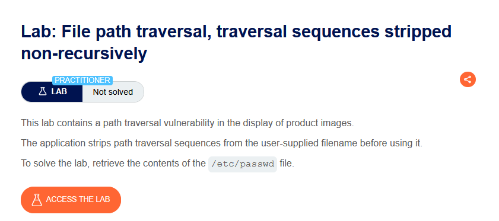
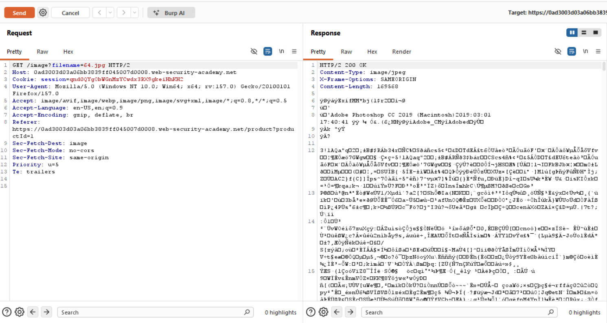
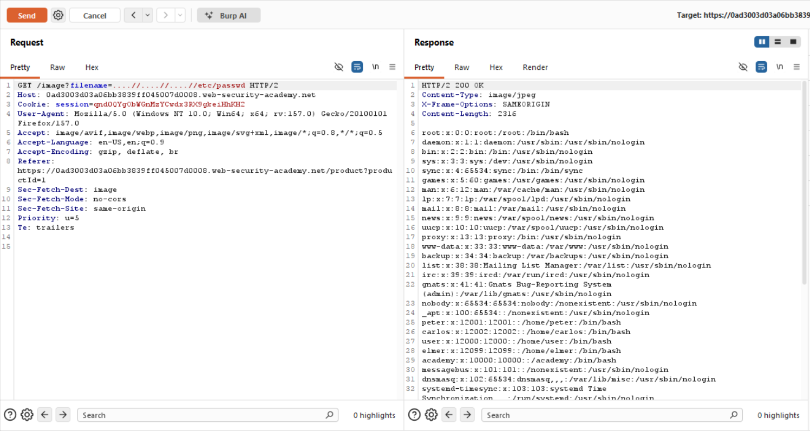

# Path Traversal — Traversal Dizileri Özyinelemesiz (Non-Recursive) Temizleniyor

**Lab:** File path traversal, traversal sequences stripped non-recursively
**Seviye:** Practitioner
**Kategori:** Path Traversal (Directory Traversal)
**Araçlar:** Burp Suite (Proxy / Repeater)
**Lab linki:** https://portswigger.net/web-security/file-path-traversal/lab-sequences-stripped-non-recursively

---

## Zafiyetin Özeti

Bu lab yine ürün görsellerinde path traversal açığı içeriyor. Bu seferki savunma: uygulama, kullanıcıdan gelen dosya adını kullanmadan önce **traversal dizilerini (`../`) temizliyor (strip ediyor)** — yani girdiden `../` örüntülerini silip kalanı kullanıyor. Amaç yine `/etc/passwd` okumak.

Kritik nokta şudur: bu temizleme **özyinelemesiz (non-recursive)**, yani girdi üzerinde **yalnızca bir kez** çalışıyor. Çözüm tam da bu eksikliği istismar ediyor.

## Lab Açıklaması



## Çözüm Adımları

### 1. Normal istek

Görsel isteğini Burp Repeater'a gönderiyoruz; normal istek görseli döndürüyor (`200 OK`, `image/jpeg`):

```
GET /image?filename=64.jpg
```



### 2. İç içe geçmiş (nested) payload

Klasik `../` temizleneceği için, temizleme işleminden **sonra** geriye `../` kalacak şekilde iç içe bir payload gönderiyoruz:

```
GET /image?filename=....//....//....//etc/passwd
```

Yanıt `200 OK` dönüyor ve gövdede `/etc/passwd` içeriği görünüyor (`root:x:0:0:...`). Lab çözüldü.



## Neden Çalışıyor? (İşin Mantığı)

Bu zafiyetin kaynağı, **temizleme (sanitization) işleminin özyinelemesiz yapılmasıdır.** Adım adım bakalım.

Uygulama, girdideki `../` (ve muhtemelen `..\`) örüntülerini bulup siliyor; ama bu silme işlemini **yalnızca tek bir geçişte** yapıyor ve sonucu tekrar kontrol etmiyor. Yani "sil, bitti" diyor; silme sonrası ortaya yeni bir `../` çıkıp çıkmadığına bakmıyor.

Payload'ımız `....//` bloklarından oluşuyor. Tek bir `....//` bloğunu ele alalım:

```
....//
```

Uygulama bunun **içinde** bir `../` örüntüsü arıyor. `....//` dizisinin ortasında gizli bir `../` vardır:

```
.  .  . .  /  /
     └──┘
      ../   ← ortadaki "../" burada
```

Daha açık göstermek için karakterleri numaralayalım — `....//` altı karakterdir: `.` `.` `.` `.` `/` `/`. Uygulama ortadaki `../` örüntüsünü (3. ve 4. nokta + ilk `/`... aslında "`..`" + "`/`") bulup siliyor. `....//` içinden bir `../` çıkarıldığında geriye şu kalır:

```
....//   →  (ortadaki ../ silinir)  →  ../
```

Yani her `....//` bloğu, tek geçişlik temizlemeden sonra temiz bir `../` haline geliyor. Temizleme **özyinelemeli olsaydı**, ortaya çıkan bu yeni `../`'yi de yakalayıp silerdi ve saldırı başarısız olurdu. Ama temizleme tek geçiş olduğu için, ortaya çıkan `../` olduğu gibi kalıyor.

Sonuçta sunucunun gördüğü nihai yol şu hale geliyor:

```
....//....//....//etc/passwd
   │        │        │
   ▼        ▼        ▼
  ../      ../      ../        →   ../../../etc/passwd
```

Böylece temizlemeden sonra elimizde tam da istediğimiz `../../../etc/passwd` kalıyor ve dosya sisteminin köküne çıkıp `/etc/passwd`'e ulaşıyoruz.

**Özet:** Filtre `../` arıyor ama biz ona, sildikten sonra geriye yine `../` bırakan bir girdi veriyoruz. Zafiyetin kök sebebi, temizlemenin "çıktı artık temiz mi?" kontrolünü yapmadan tek seferde bitmesidir.

## Önlem

- **Kara liste temelli temizleme kullanmamak:** `../` dizilerini "silerek temizleme" yaklaşımı doğası gereği kırılgandır (`....//`, kodlama hileleri vb. ile atlatılabilir). Özyinelemeli temizleme bile çoğu zaman tüm varyasyonları yakalayamaz.
- **Kanonikleştirme + sınır kontrolü (önerilen):** Girdi tam (canonical) yola çözümlendikten sonra, oluşan yolun beklenen temel dizinin altında kaldığı doğrulanmalı:
  ```
  canonical = realpath(base + input)
  if not canonical.startsWith(realpath(base)): reddet
  ```
  Bu yöntem, girdi hangi hileyle yazılırsa yazılsın (çünkü işletim sisteminin kendi yol çözümlemesine dayanır) güvenlidir.
- **Girdiyi dosya yoluna hiç koymamak:** Dosyaları kimlik/indeks üzerinden sunmak en sağlam çözümdür.
- **En az yetki prensibi:** Uygulama kullanıcısının sistem dosyalarına gereksiz okuma yetkisi olmamalı.
