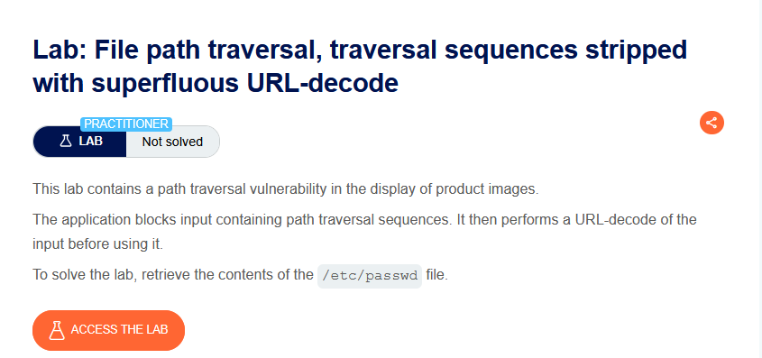
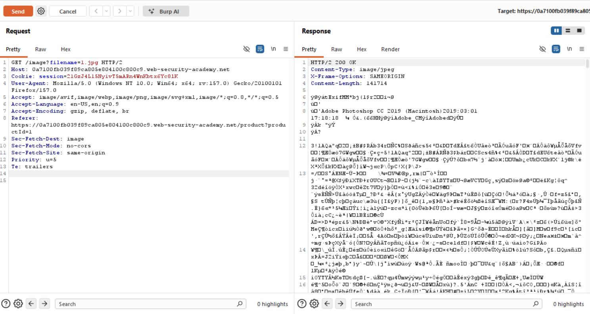
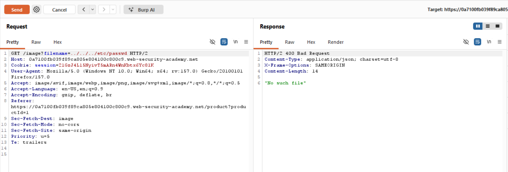
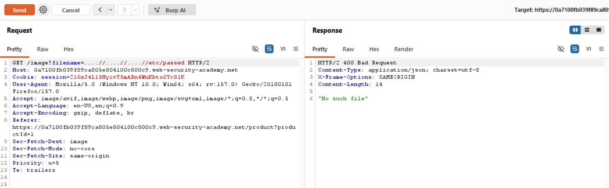
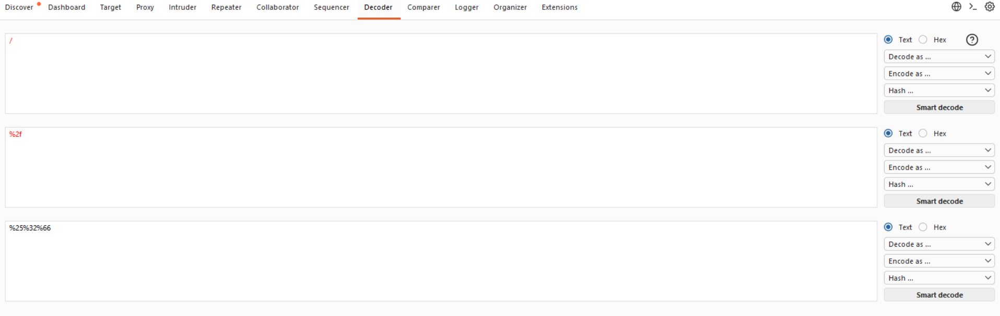

# Path Traversal — Bypass via Superfluous URL-Decode

**Lab:** File path traversal, traversal sequences stripped with superfluous URL-decode
**Level:** Practitioner
**Category:** Path Traversal (Directory Traversal)
**Tools:** Burp Suite (Proxy / Repeater / Decoder)
**Lab link:** https://portswigger.net/web-security/file-path-traversal/lab-sequences-stripped-with-superfluous-url-decode

---

## Vulnerability Summary

This lab again contains a path traversal flaw in product images. The defense this time has two stages, and the root cause hides exactly in the order of these two stages:

1. The application **blocks input containing a path traversal sequence** (e.g. rejects it if it sees `../`).
2. It then **performs one more URL-decode** on the input before using it.

This second, "superfluous" URL-decode step is the source of the vulnerability. The goal is again to read `/etc/passwd`.

## Lab Description



## Solution Steps

### 1. Normal request

We send the image request to Burp Repeater; the normal request returns the image (`200 OK`):

```
GET /image?filename=1.jpg
```



### 2. Classic traversal — blocked

```
GET /image?filename=../../../etc/passwd
```

Response: `400 Bad Request`, `"No such file"`. The `../` sequence is detected directly and blocked.



### 3. Nested attempt — also blocked here

We try the `....//` trick from the previous lab:

```
GET /image?filename=....//....//....//etc/passwd
```

Again `400 Bad Request`, `"No such file"`. This lab's filter catches that variation too, so a different route is needed.



### 4. Bypass via double URL-encode

After a few tries, we found that it is enough to **double URL-encode only the `/` character**. Using Burp Decoder we produce the double encoding of `/`:

```
/        (raw character)
%2f      (URL-encoded once)
%252f    (URL-encoded twice — or, fully, %25%32%66)
```



The final payload — only `/` double-encoded, `..` and the rest plain:

```
GET /image?filename=..%252f..%252f..%252fetc/passwd
```

This request returns the contents of `/etc/passwd` (`root:x:0:0:...`) and the lab is solved.

## Why It Works (The Logic)

The key is **how many times the input is URL-decoded** along its journey. Let's trace a single `/` in our payload (encoded as `%252f`) step by step:

**Step 1 — Server/framework automatic decode.**
The web server standardly URL-decodes the query parameters of an incoming request once. So `%252f` is automatically decoded once:

```
%252f   →   %2f
```

After this stage our input is `..%2f..%2f..%2fetc/passwd`.

**Step 2 — The application's traversal filter.**
The application now looks for `../` (or `..\`) in the input. But the value we have is `..%2f...`; it contains **no literal `../`**, only `..%2f`. The filter therefore sees no traversal sequence and **passes the input, thinking it is clean.** This is the blind spot of the defense.

**Step 3 — Superfluous URL-decode.**
Right before opening the file, the application URL-decodes the input **one more time**. This second decode turns `%2f` into a real `/`:

```
..%2f..%2f..%2fetc/passwd   →   ../../../etc/passwd
```

And because this conversion happens **after** the filter check, it is no longer inspected. The file-open function thus receives exactly the `../../../etc/passwd` we wanted, and `/etc/passwd` is read.

**In short:** The input is decoded **twice** in total (once by the framework's automatic decode, once by the application's extra decode). Our double-encoded `/` looks "harmless" as `%2f` after the first decode and slips past the filter; the second (superfluous) decode then turns it into a real `/` after the filter has already run, completing the traversal. The root cause is that **validation is done at an intermediate stage rather than after all decoding is complete** — the application is unaware that its own extra decode invalidates the filter.

> Note: Why did we encode only `/`? Because the filter essentially catches the traversal sequence containing `/` (`../`). By hiding the `/`, the filter cannot see `..%2f` as a sequence; there is no need to also encode the `..` dots. (We could have encoded the dots with `%252e` too, but it was not necessary.)

## Remediation

- **Finish all decoding before validation:** Whatever decoding the input will undergo before use should all be completed first; validation/sanitization must happen **last**, on the final value. Adding an extra decode in between or after invalidates the entire filter.
- **Canonicalization + boundary check instead of a blacklist (recommended):** After resolving the input to its final canonical path, verify that the resulting path stays under the expected base directory. This method is immune to encoding tricks:
  ```
  canonical = realpath(base + input)
  if not canonical.startsWith(realpath(base)): reject
  ```
- **Don't put input into file paths at all:** Serving files via an identifier/index is the most robust solution.
- **Principle of least privilege:** The application account should not have needless read access to system files.
