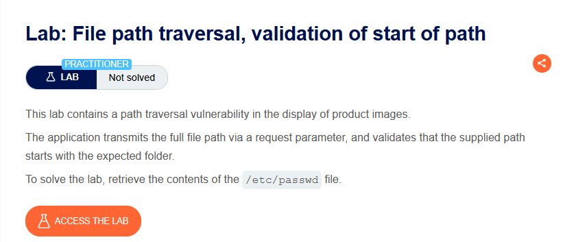
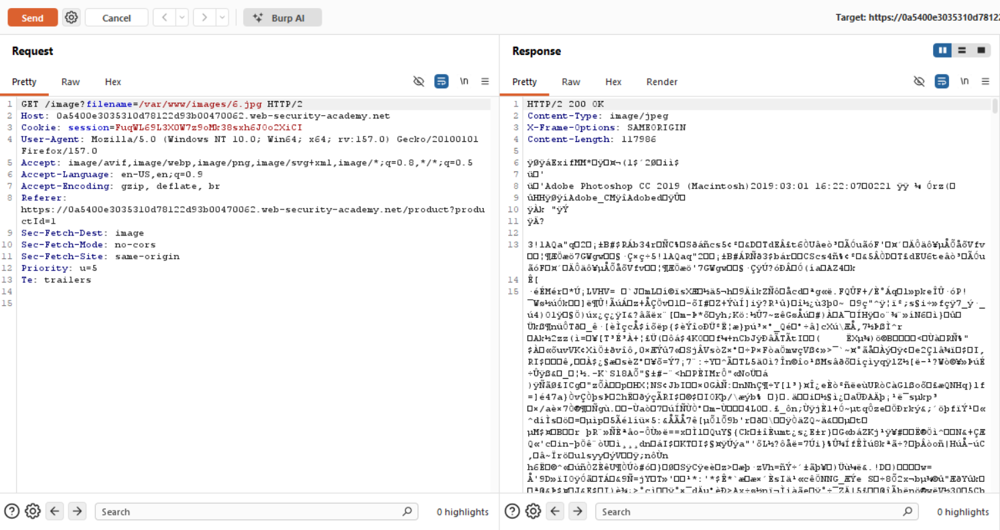
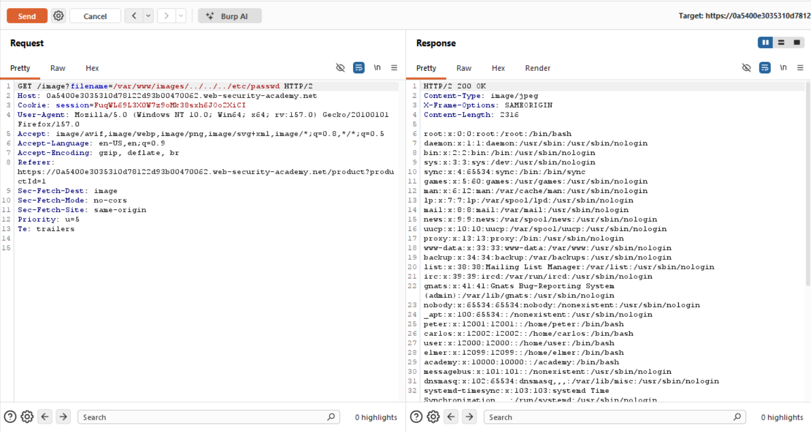

# Path Traversal — Yolun Başının Doğrulanması (Validation of Start of Path)

**Lab:** File path traversal, validation of start of path
**Seviye:** Practitioner
**Kategori:** Path Traversal (Directory Traversal)
**Araçlar:** Burp Suite (Proxy / Repeater)
**Lab linki:** https://portswigger.net/web-security/file-path-traversal/lab-validate-start-of-path

---

## Zafiyetin Özeti

Bu lab yine ürün görsellerinde path traversal açığı içeriyor; ama bu kez çalışma biçimi öncekilerden farklı. Uygulama **tam dosya yolunu** bir istek parametresi üzerinden alıyor (göreli bir dosya adı değil) ve verilen yolun **beklenen klasörle başlayıp başlamadığını** doğruluyor.

Yani normal istekte `filename` doğrudan tam yolu taşıyor:

```
GET /image?filename=/var/www/images/6.jpg
```

Uygulamanın tek güvenlik kontrolü: "verilen yol `/var/www/images/` ile başlıyor mu?" Amaç yine `/etc/passwd` okumak.

## Lab Açıklaması



## Çözüm Adımları

### 1. Normal istek

Görsel isteğini Burp Repeater'a gönderiyoruz. Dikkat: `filename` zaten tam yolu içeriyor:

```
GET /image?filename=/var/www/images/6.jpg
```

Yanıt `200 OK`, görsel dönüyor.



### 2. Beklenen klasörle başlayıp sonra yukarı çıkma

Doğrulama yalnızca yolun **başına** baktığı için, payload'ı beklenen klasörle başlatıp ardından `../` ile yukarı çıkıyoruz:

```
GET /image?filename=/var/www/images/../../../etc/passwd
```

Yanıt `200 OK` dönüyor ve gövdede `/etc/passwd` içeriği görünüyor (`root:x:0:0:...`). Lab çözüldü.



## Neden Çalışıyor? (İşin Mantığı)

Buradaki savunma mantığı şu basit varsayıma dayanıyor: *"Eğer yol `/var/www/images/` ile başlıyorsa, dosya o klasörün içindedir ve güvenlidir."* Bu varsayım yanlıştır.

Payload'ımızı inceleyelim:

```
/var/www/images/../../../etc/passwd
└──── başlangıç ────┘└──── traversal ────┘
```

- **Başlangıç kısmı** (`/var/www/images/`) doğrulamayı geçmek için var. Uygulama "yol beklenen klasörle başlıyor mu?" diye baktığında cevap **evet** oluyor; kontrol başarıyla geçiliyor.
- **Traversal kısmı** (`../../../etc/passwd`) ise doğrulamadan sonra devreye giriyor. İşletim sistemi yolu çözümlerken `../` dizilerini uygular ve `/var/www/images/`'ten üç dizin yukarı çıkarak dosya sisteminin köküne iner, oradan `/etc/passwd`'e gider:

```
/var/www/images/../../../etc/passwd
         ↓ (../ üç kez uygulanır)
/etc/passwd
```

Kök sebep şudur: uygulama yolun yalnızca **nasıl başladığını** kontrol ediyor, ama **nereye vardığını** (nihai, çözümlenmiş hedefi) kontrol etmiyor. Bir yolun doğru önekle başlaması, o yolun o dizinin *içinde kalacağını* garanti etmez — çünkü `../` ile aynı yol içinden dışarı çıkılabilir. "Başlangıç doğru" ile "hedef güvenli" aynı şey değildir.

## Önlem

- **Başlangıcı değil, nihai hedefi doğrulamak (kanonikleştirme + sınır kontrolü):** Doğru yaklaşım, yolu önce tam (canonical) biçime çözümleyip (`../` dizileri uygulandıktan sonra) sonucun beklenen dizinin altında kalıp kalmadığını kontrol etmektir:
  ```
  canonical = realpath(input)         # ../'lar uygulanır, gerçek hedef bulunur
  if not canonical.startsWith(realpath("/var/www/images/")): reddet
  ```
  Bu yöntemde `/var/www/images/../../../etc/passwd` önce `/etc/passwd`'e çözümlenir, sonra kontrol edilir ve `/var/www/images/` ile başlamadığı için reddedilir.
- **Girdiyi dosya yoluna hiç koymamak:** Dosyaları kimlik/indeks üzerinden sunmak en sağlam çözümdür.
- **En az yetki prensibi:** Uygulama kullanıcısının sistem dosyalarına gereksiz okuma yetkisi olmamalı.
