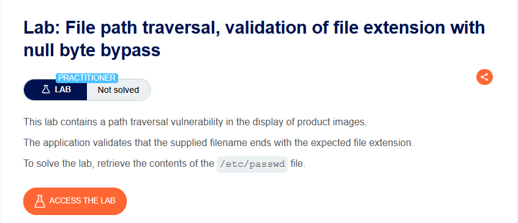
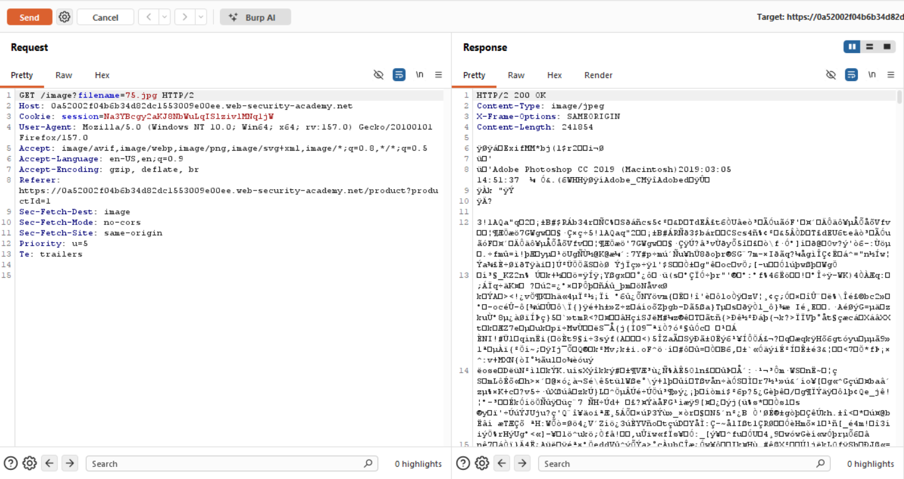
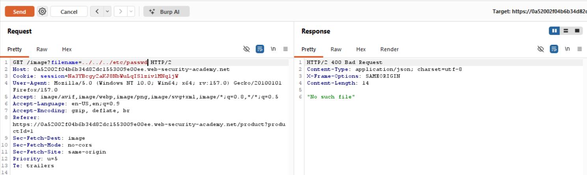
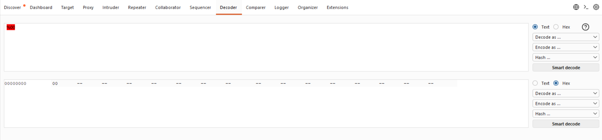
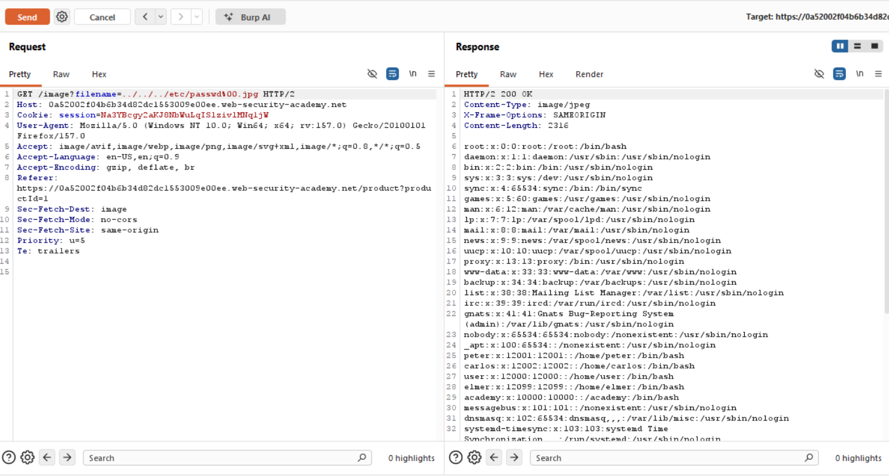

# Path Traversal — Dosya Uzantısı Doğrulamasını Null Byte ile Atlatma

**Lab:** File path traversal, validation of file extension with null byte bypass
**Seviye:** Practitioner
**Kategori:** Path Traversal (Directory Traversal)
**Araçlar:** Burp Suite (Proxy / Repeater / Decoder)
**Lab linki:** https://portswigger.net/web-security/file-path-traversal/lab-validate-file-extension-null-byte-bypass

---

## Zafiyetin Özeti

Bu lab yine ürün görsellerinde path traversal açığı içeriyor. Bu seferki savunma: uygulama, verilen dosya adının **beklenen uzantıyla (ör. `.jpg`) bitip bitmediğini** doğruluyor. Amaç yine `/etc/passwd` okumak.

Çözüm, bir **null byte (`%00`)** enjekte ederek hem bu uzantı kontrolünü geçmek hem de işletim sistemi dosyayı açarken yolu uzantıdan önce kesmektir.

## Lab Açıklaması



## Çözüm Adımları

### 1. Normal istek

Görsel isteğini Burp Repeater'a gönderiyoruz; normal istek görseli döndürüyor (`200 OK`):

```
GET /image?filename=75.jpg
```



### 2. Klasik traversal — engelleniyor

```
GET /image?filename=../../../etc/passwd
```

Yanıt `400 Bad Request`, `"No such file"`. `/etc/passwd` beklenen `.jpg` uzantısıyla bitmediği için uzantı doğrulaması isteği reddediyor.



### 3. Null byte'ı hazırlamak

Null byte, URL kodlamasında `%00` ile gösterilir ve tek bir `0x00` (sıfır) baytına karşılık gelir. Burp Decoder'da `%00`'ın gerçekten tek bir null bayta çözüldüğünü doğruluyoruz (hex görünümünde `00`):



### 4. Null byte ile atlatma

Payload'ı, hedef dosyadan sonra bir null byte ve ardından beklenen uzantıyı gelecek şekilde oluşturuyoruz:

```
GET /image?filename=../../../etc/passwd%00.jpg
```

Yanıt `200 OK` dönüyor ve gövdede `/etc/passwd` içeriği görünüyor (`root:x:0:0:...`). Lab çözüldü.



## Neden Çalışıyor? (İşin Mantığı)

Bu bypass, iki farklı katmanın aynı string'i **farklı yorumlamasından** doğar. Payload'ımız:

```
../../../etc/passwd%00.jpg
```

**1. Katman — Uygulamanın uzantı doğrulaması (yüksek seviye kod).**
Uygulama, string'in tamamına bakar: `../../../etc/passwd` + null + `.jpg`. Sonuna baktığında string'in `.jpg` ile bittiğini görür ve uzantı kontrolünü **geçer.** Çünkü bu katman (ör. Java, PHP gibi yüksek seviye dillerin string tipleri) null byte'ı sıradan bir karakter olarak taşır; string'i orada kesmez.

**2. Katman — İşletim sistemi dosya açma çağrısı (düşük seviye / C).**
Uygulama dosyayı açmak için işletim sistemine bu yolu ilettiğinde, alttaki C tabanlı dosya API'leri string'leri **null ile sonlandırılmış (null-terminated)** kabul eder. Yani `0x00` baytını "string burada bitti" işareti olarak yorumlar ve sonrasını (`.jpg`) tamamen yok sayar. İşletim sisteminin gördüğü gerçek yol şudur:

```
../../../etc/passwd%00.jpg
                   ▲
                   └── null byte: string burada biter
→ işletim sistemi şu dosyayı açar:  ../../../etc/passwd
```

Sonuç: `.jpg` uzantısı yalnızca uygulamanın doğrulamasını kandırmak için vardır; gerçekte açılan dosya `/etc/passwd`'dir.

**Özetle kök sebep:** Uzantı kontrolünü yapan katman null byte'ı normal karakter sayıyor (yani `.jpg`'yi görüyor), dosyayı açan alt katman ise null byte'ı string sonu sayıyor (yani `.jpg`'yi atıyor). Bu yorum farkı, hem "uzantı doğru" kontrolünü geçmemizi hem de gerçek hedefe ulaşmamızı aynı anda sağlıyor.

> Tarihsel not: Null byte enjeksiyonu, özellikle dize işlemeyi yüksek seviye bir dilde yapıp dosya erişimini null-terminated string kullanan alt katmanlara devreden eski sistemlerde etkiliydi. Modern dil ve çatıların çoğu artık yol içindeki null byte'ı reddeder; yine de eski/karma sistemlerde karşılaşılabilir.

## Önlem

- **Null byte dahil tehlikeli karakterleri reddetmek:** Dosya adında null byte (`\0` / `%00`) ve yol ayraçları gibi beklenmeyen karakterler kesinlikle reddedilmeli.
- **Kanonikleştirme + sınır kontrolü (önerilen):** Girdi tam (canonical) yola çözümlendikten sonra, oluşan yolun beklenen temel dizinin altında kaldığı doğrulanmalı. Uzantı kontrolü de bu çözümlenmiş, güvenli yol üzerinde yapılmalı:
  ```
  canonical = realpath(base + input)
  if not canonical.startsWith(realpath(base)): reddet
  if not canonical.endsWith(".jpg"): reddet
  ```
- **Girdiyi dosya yoluna hiç koymamak:** Dosyaları kimlik/indeks üzerinden sunmak en sağlam çözümdür.
- **En az yetki prensibi:** Uygulama kullanıcısının sistem dosyalarına gereksiz okuma yetkisi olmamalı.
