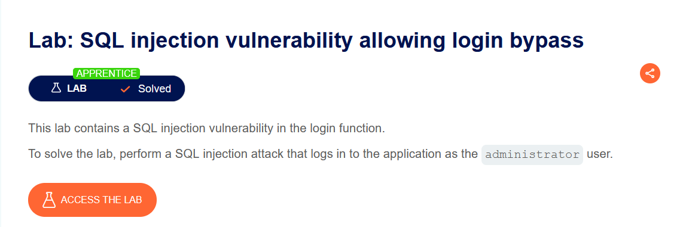
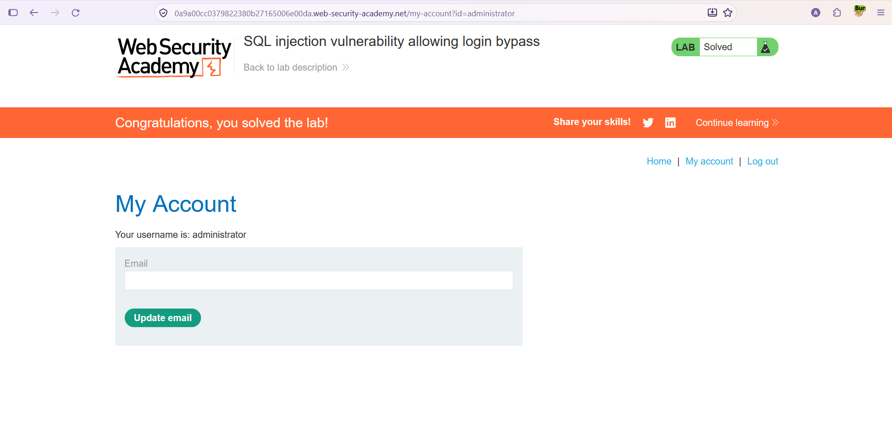

# SQL Injection — Login Bypass (Oturum Açma Atlatma)

**Lab:** SQL injection vulnerability allowing login bypass
**Seviye:** Apprentice
**Kategori:** SQL Injection
**Araçlar:** Tarayıcı (login formu), Burp Suite (isteğe bağlı)
**Lab linki:** https://portswigger.net/web-security/sql-injection/lab-login-bypass

---

## Zafiyetin Özeti

Uygulamanın oturum açma (login) fonksiyonu, kullanıcı adı ve parolayı doğrudan SQL sorgusuna ekliyor. Giriş denemesinde arka planda şuna benzer bir sorgu çalışıyor:

```sql
SELECT * FROM users WHERE username = 'wiener' AND password = 'peter'
```

Sorgu bir satır döndürürse giriş başarılı kabul ediliyor. `username` değeri tırnak içinde, kullanıcı girdisiyle birleştirildiği için bu alana enjeksiyon yapıp parola kontrolünü tamamen devre dışı bırakabiliyoruz.

Amaç: parolayı bilmeden `administrator` kullanıcısı olarak giriş yapmak.

## Lab Açıklaması



## Çözüm Adımları

Bu lab'i login formunu kullanarak, `username` alanına enjeksiyon yaparak çözdük.

### 1. Sorgunun yapısını anlamak

Normal bir girişte sorgu şöyle çalışır:

```sql
SELECT * FROM users WHERE username = 'KULLANICI' AND password = 'PAROLA'
```

Burada `username` alanını enjeksiyon için kullanacağız.

### 2. Payload'ı oluşturmak

`username` alanına şu değeri giriyoruz:

```
administrator' OR 1=1--
```

Parola alanına ise herhangi bir değer yazılabilir (sorgudan çıkarılacağı için önemi yok).


Payload'ın parçalanmış hali:

- `administrator'` → Kullanıcı adı için açılan tırnağı kapatır ve string literalini sonlandırır.
- `OR 1=1` → Her zaman doğru olan bir koşul ekler.
- `--` → SQL yorum işaretidir. Kendisinden sonra gelen kısmı, yani `AND password = '...'` koşulunu tamamen devre dışı bırakır.

Enjeksiyondan sonra sorgu şuna dönüşür:

```sql
SELECT * FROM users WHERE username = 'administrator' OR 1=1--' AND password = '...'
```

Yorum satırı sayesinde çalışan asıl sorgu:

```sql
SELECT * FROM users WHERE username = 'administrator' OR 1=1
```

Parola kontrolü tamamen ortadan kalktığı için uygulama parolayı hiç doğrulamaz. Sorgu bir satır döndürdüğünden giriş başarılı sayılır.

> **Not:** Alternatif ve daha "temiz" bir payload `administrator'--` şeklindedir. Bu da yalnızca `username = 'administrator'` koşulunu bırakıp parola kontrolünü yorum satırına alır. Her ikisi de bu lab'i çözer; bu writeup'ta kullandığımız `administrator' OR 1=1--` payload'ıdır.

### 3. Sonuç

Giriş yapıldığında `administrator` kullanıcısının hesabına erişiyoruz ve lab çözülmüş olarak işaretleniyor.



## Neden Çalışıyor?

Temel sorun, kullanıcı girdisinin (özellikle `username`) SQL sorgusuna string birleştirmeyle eklenmesi. Uygulama girdiyi veri olarak değil, sorgunun bir parçası olarak yorumluyor. Böylece tırnak ve SQL anahtar kelimeleri enjekte ederek sorgunun mantığını değiştirip parola kontrolünü atlayabiliyoruz.

## Önlem

- **Parametreli sorgular (prepared statements):** Kullanıcı adı ve parola sorguya birleştirilmek yerine parametre olarak bağlanmalı. Böylece girdi hiçbir zaman SQL kodu olarak çalışmaz.
- **Parolaların güvenli saklanması ve doğrulanması:** Parolalar düz metin karşılaştırmasıyla değil, güçlü bir hash algoritmasıyla (örn. bcrypt) saklanıp doğrulanmalı. Doğru tasarlanmış bir kimlik doğrulama akışında parola karşılaştırması tek bir SQL koşuluna indirgenmez.
- **En az yetki prensibi:** Uygulamanın veritabanı kullanıcısı yalnızca ihtiyaç duyduğu yetkilere sahip olmalı.
