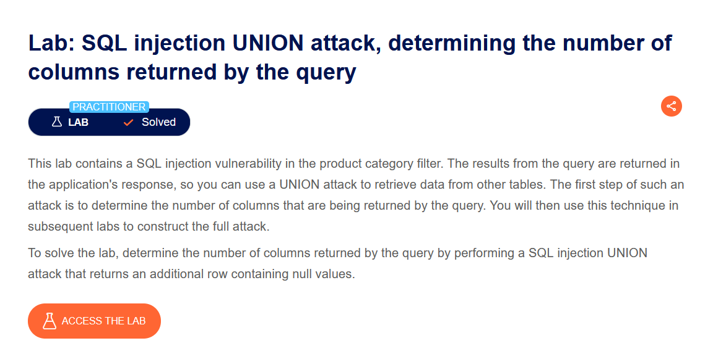
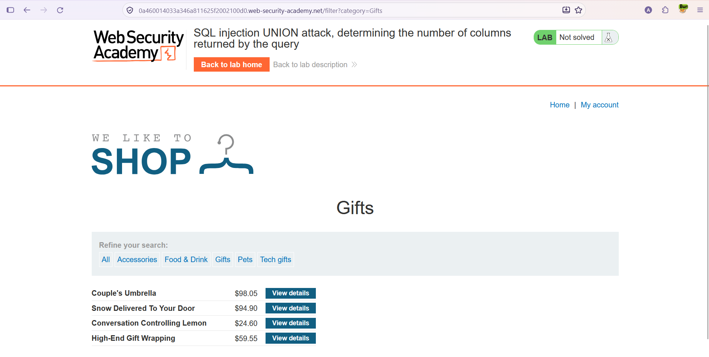
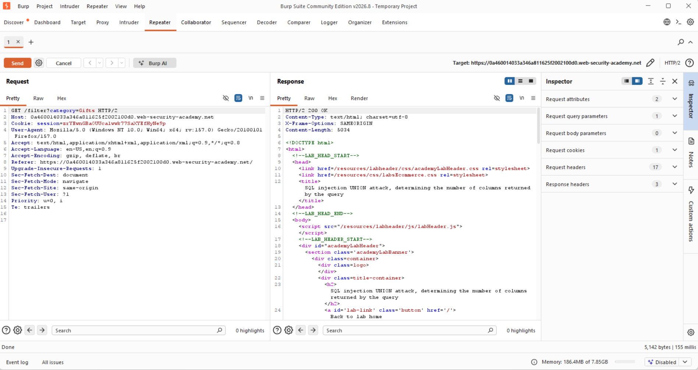
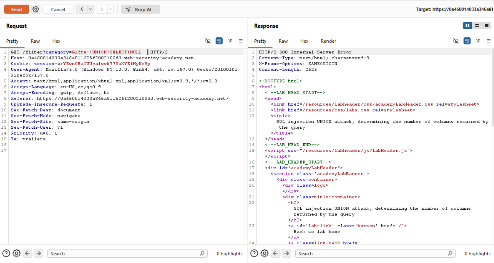
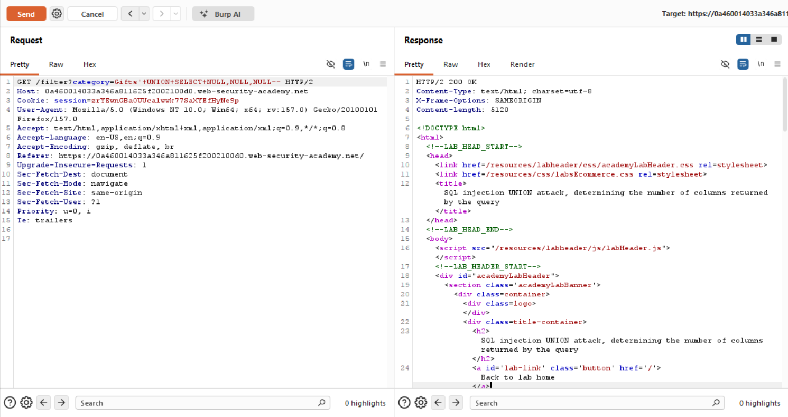
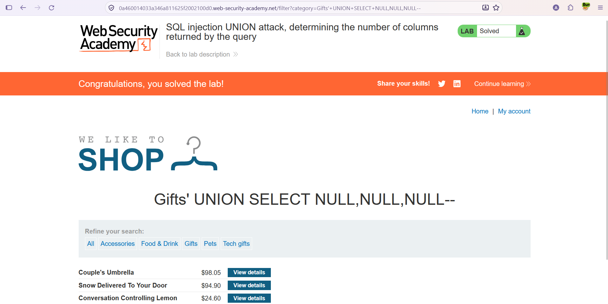

# SQL Injection — UNION Attack: Determining the Number of Columns

**Lab:** SQL injection UNION attack, determining the number of columns returned by the query
**Level:** Practitioner
**Category:** SQL Injection (UNION)
**Tools:** Burp Suite (Proxy + Repeater), browser
**Lab link:** https://portswigger.net/web-security/sql-injection/union-attacks/lab-determine-number-of-columns

---

## Vulnerability Summary

The product category filter is vulnerable to SQL injection, and the query results are shown directly on the page. In this case we can use a `UNION` attack to retrieve data from other tables.

For a `UNION` to work, two conditions must hold:

1. The two combined queries must return the **same number of columns**.
2. The data types of the corresponding columns must be **compatible**.

So the first step of a UNION attack is to find how many columns the original query returns. This lab targets exactly that step: return an additional row of `NULL` values using the correct column count.

## Lab Description



## Method

The standard way to determine the column count is a `UNION SELECT` with an increasing number of `NULL`s:

```
' UNION SELECT NULL--
' UNION SELECT NULL,NULL--
' UNION SELECT NULL,NULL,NULL--
```

`NULL` is used because it can be cast to any data type, avoiding type-mismatch issues so we can focus only on the column count. When the column count is wrong, the application usually returns an **error** (e.g. HTTP 500); when it matches, the response comes back **without error** (HTTP 200).

## Solution Steps

### 1. Inspect the normal request

First we view the category filter normally. Selecting the "Gifts" category lists the products, and the lab is still unsolved.



### 2. Capture the request with Burp and send it to Repeater

We capture the request with Burp Proxy and send it to Repeater, where we can replay attempts and compare responses easily. Below is the normal `GET /filter?category=Gifts` request with its `200 OK` response.



### 3. Test the column count

We inject UNION payloads with an increasing number of `NULL`s into the `category` parameter.

**One-column attempt** — `Gifts' UNION SELECT NULL--`

This request returns `500 Internal Server Error`, meaning the original query does not return a single column.



**Three-column attempt** — `Gifts' UNION SELECT NULL,NULL,NULL--`

Continuing to increase the column count, three `NULL`s produce a `200 OK` response. Since the error is gone, the original query returns **3 columns**.



> Per the method, the NULL count starts at 1 and increases one at a time (1 → 2 → 3). The first value where the error disappears is the correct column count. Here the error cleared at 3.

### 4. Confirm in the browser

We also run the correct payload in the browser via the URL:

```
/filter?category=Gifts'+UNION+SELECT+NULL,NULL,NULL--
```

The page loads without error and the lab is marked as solved.



## Why It Works

`UNION` combines the results of two `SELECT` queries into a single result set. Because we can run an extra `SELECT` at the injection point, we can append our own row to the results as soon as the column count matches. `NULL` values remove any type-compatibility concern, so at this stage we only need to determine the column count. This is the foundation for the next step (data exfiltration), where we find which columns can hold readable text.

## Remediation

- **Parameterized queries (prepared statements):** Bind user input as a parameter instead of concatenating it into the query, so expressions like `UNION` cannot be injected.
- **Input validation (allow-list):** Validate parameters like `category` only against a known set of allowed values.
- **Hide verbose error messages:** Reflecting database errors to the user gives the attacker feedback; production should use generic error pages. (Not a sufficient control on its own — the real fix is parameterized queries.)
