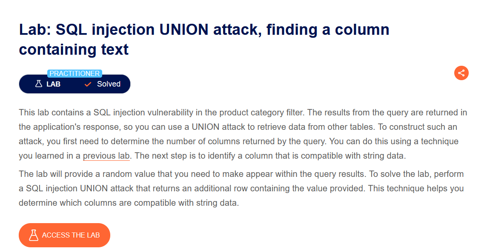
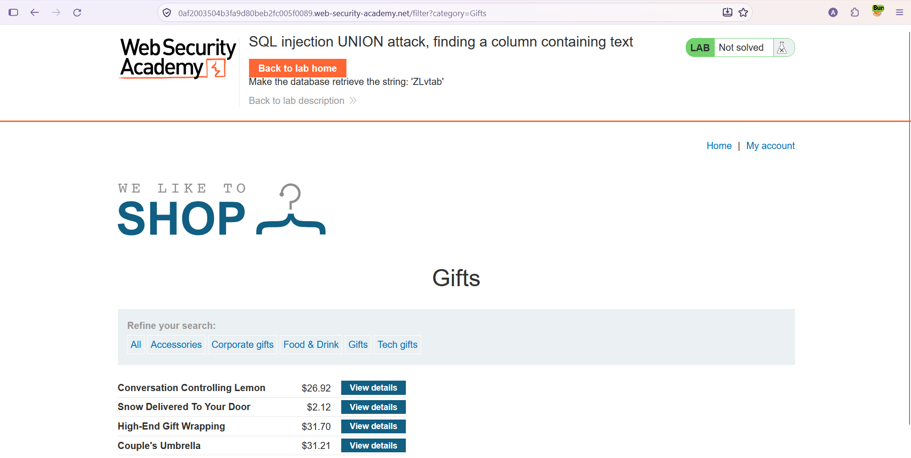
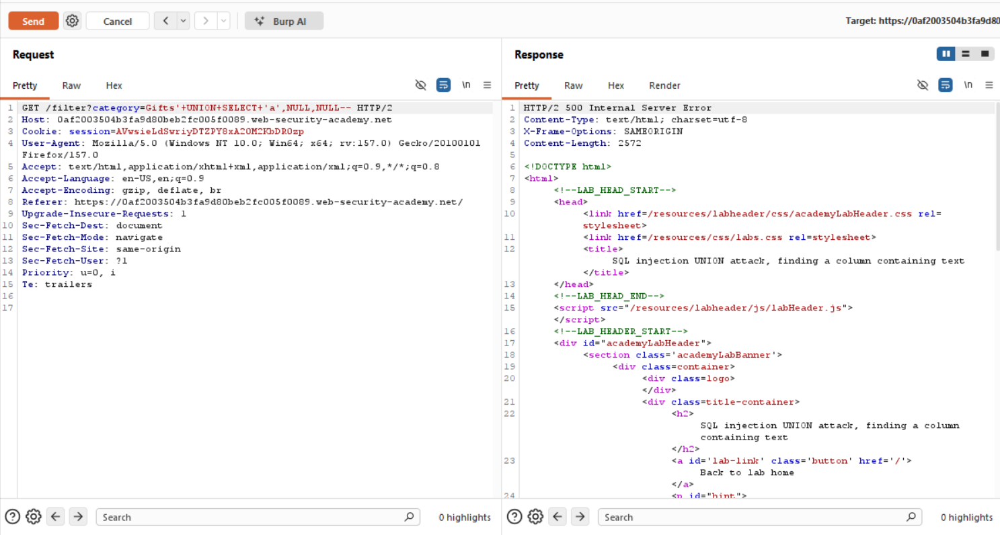
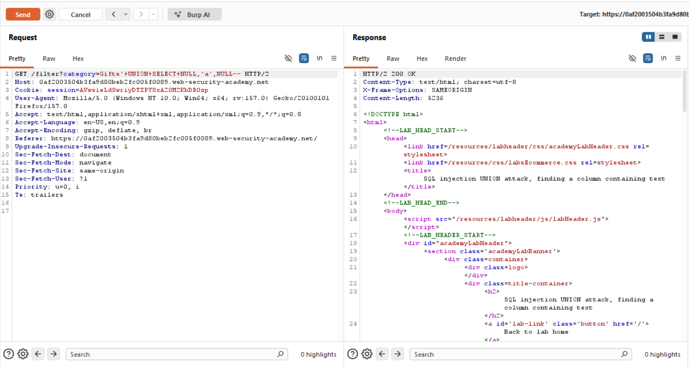
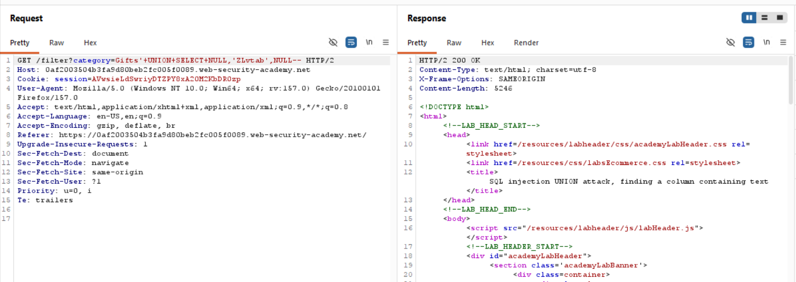
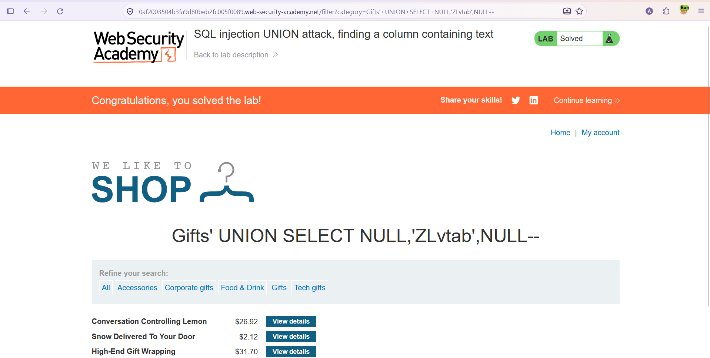

# SQL Injection — UNION Attack: String (Metin) İçeren Sütunu Bulma

**Lab:** SQL injection UNION attack, finding a column containing text
**Seviye:** Practitioner
**Kategori:** SQL Injection (UNION)
**Araçlar:** Burp Suite (Proxy + Repeater), tarayıcı
**Lab linki:** https://portswigger.net/web-security/sql-injection/union-attacks/lab-find-column-containing-text

---

## Zafiyetin Özeti

Kategori filtresi SQL enjeksiyonuna açık ve sorgu sonuçları sayfada gösteriliyor; yani `UNION` saldırısıyla başka verileri sonuçlara ekleyebiliriz. Bir önceki adımda sütun **sayısını** bulmuştuk. Bu lab'de amaç, bu sütunlardan hangisinin **string (metin) veri tipiyle uyumlu** olduğunu bulmaktır.

Bu bilgi önemlidir çünkü veritabanından metinsel veri (kullanıcı adı, parola vb.) sızdırabilmek için, onu yerleştirebileceğimiz metin uyumlu bir sütuna ihtiyacımız vardır. Lab bize rastgele bir metin değeri veriyor (`ZLvtab`) ve bunu sorgu sonuçlarında göstermemizi istiyor.

## Lab Açıklaması



## Yöntem

Metin uyumlu sütunu bulmak için, bilinen sütun sayısı kadar `NULL` listesi hazırlanır ve her seferinde bir `NULL` yerine string bir değer (`'a'`) konur:

```
' UNION SELECT 'a',NULL,NULL--
' UNION SELECT NULL,'a',NULL--
' UNION SELECT NULL,NULL,'a'--
```

Hangi denemede yanıt **hatasız** (HTTP 200) dönerse, `'a'` koyduğumuz konumdaki sütun metin verisiyle uyumludur. Yanlış tiplerde veritabanı genellikle **hata** (HTTP 500) verir.

## Çözüm Adımları

### 1. Hedef string ve normal sayfa

Lab, veritabanına şu metni getirtmemizi istiyor: **`ZLvtab`**. Normal "Gifts" sayfası görüntülendiğinde lab henüz çözülmemiş durumda.



### 2. İsteği Repeater'a gönderip sütun sayısını doğrulamak

İsteği Burp Repeater'a gönderiyoruz. Önceki yöntemle sütun sayısını doğruluyoruz: `Gifts' UNION SELECT NULL,NULL,NULL--` isteği `200 OK` dönüyor, yani sorgu **3 sütun** döndürüyor.


### 3. Hangi sütunun metin olduğunu bulmak

**1. sütun denemesi** — `Gifts' UNION SELECT 'a',NULL,NULL--`

Yanıt `500 Internal Server Error`. Demek ki 1. sütun metin verisiyle uyumlu değil.



**2. sütun denemesi** — `Gifts' UNION SELECT NULL,'a',NULL--`

Yanıt `200 OK`. Hata kayboldu; yani **2. sütun** metin verisiyle uyumlu.



### 4. Hedef string'i enjekte etmek

Metin sütununu bulduğumuza göre, `'a'` yerine lab'in istediği değeri koyuyoruz:

```
Gifts' UNION SELECT NULL,'ZLvtab',NULL--
```

İstek `200 OK` dönüyor ve `ZLvtab` değeri sonuçlara ekleniyor.



### 5. Sonuç

Aynı payload'ı tarayıcıda URL üzerinden çalıştırdığımızda `ZLvtab` sayfada görünüyor ve lab çözülmüş olarak işaretleniyor:

```
/filter?category=Gifts'+UNION+SELECT+NULL,'ZLvtab',NULL--
```



## Neden Çalışıyor?

`UNION SELECT` ile eklediğimiz satırın her sütununun, orijinal sorgunun karşılık gelen sütunuyla tip olarak uyumlu olması gerekir. `NULL` her tiple uyumlu olduğu için sütun sayısını bulmakta işe yarar; ancak metinsel veri göstermek için o sütunun string'i kabul etmesi gerekir. Bir sütuna string koyduğumuzda hata almıyorsak, o sütun metin verisi taşıyabilir. Bu sütun, sonraki adımda (kullanıcı adı/parola gibi gerçek verilerin sızdırılması) veriyi yerleştireceğimiz yerdir.

## Önlem

- **Parametreli sorgular (prepared statements):** Kullanıcı girdisi sorguya birleştirilmemeli; böylece `UNION SELECT` enjekte edilemez.
- **Girdi doğrulama (allow-list):** `category` yalnızca bilinen değerlere karşı doğrulanmalı.
- **Ayrıntılı veritabanı hatalarını gizlemek:** HTTP 500 gibi tip hatalarının saldırgana geri bildirim vermesi, sütun tiplerinin tahminini kolaylaştırır; üretimde genel hata sayfaları kullanılmalı. (Tek başına yeterli değildir; asıl çözüm parametreli sorgulardır.)
