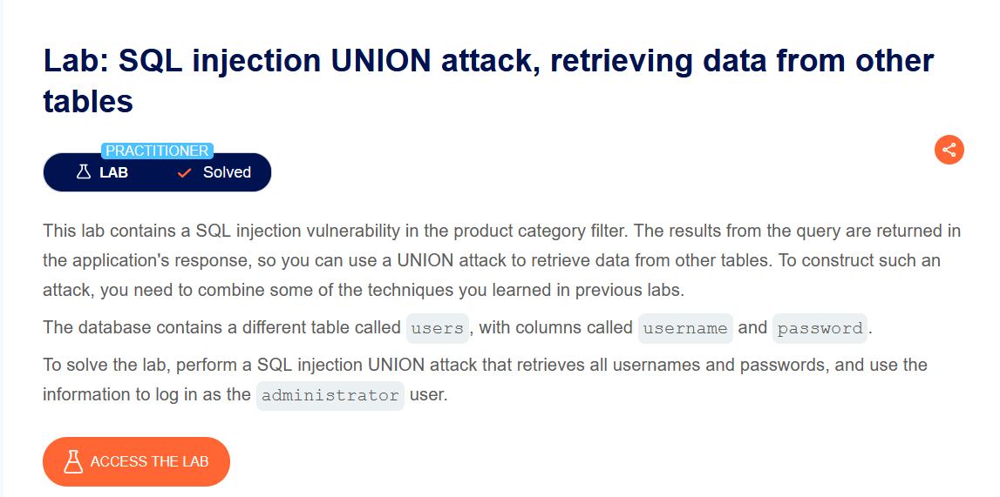
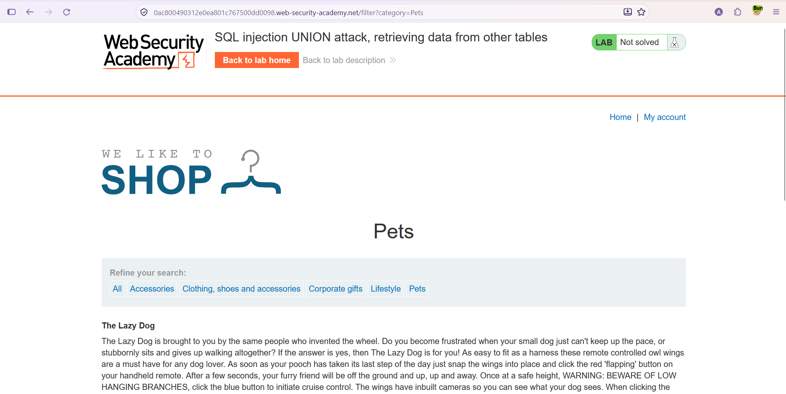
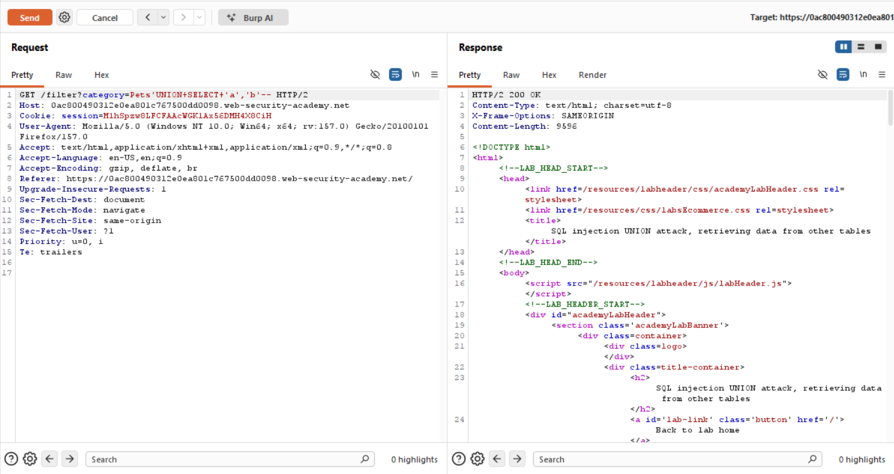
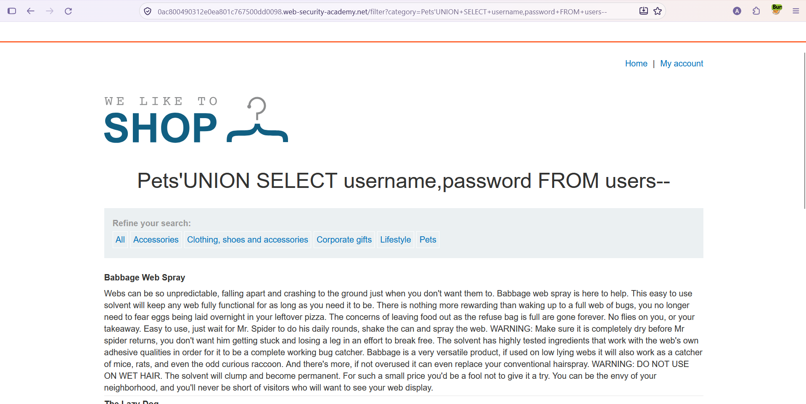
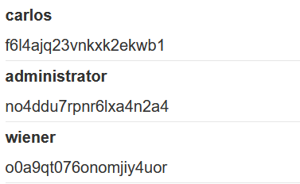
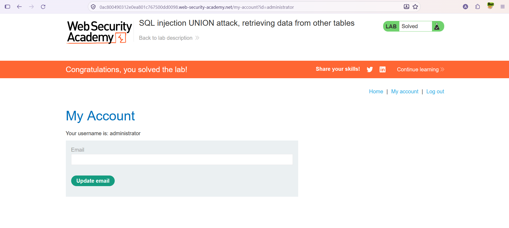

# SQL Injection — UNION Attack: Retrieving Data From Other Tables

**Lab:** SQL injection UNION attack, retrieving data from other tables
**Level:** Practitioner
**Category:** SQL Injection (UNION)
**Tools:** Burp Suite (Proxy + Repeater), browser
**Lab link:** https://portswigger.net/web-security/sql-injection/union-attacks/lab-retrieve-data-from-other-tables

---

## Vulnerability Summary

The category filter is vulnerable to SQL injection and the query results are shown on the page. This lab combines the previous steps into a real `UNION` attack: retrieving data from another table.

The database has a separate table called `users` with columns `username` and `password`. The goal is to retrieve all usernames and passwords and use them to log in as `administrator`.

## Lab Description



## Solution Steps

### 1. Normal page

When the "Pets" category is viewed, the products are listed and the lab is still unsolved.



### 2. Determine column count and types

We send the request to Burp Repeater and test the column count and types in a single step, using two string values:

```
Pets' UNION SELECT 'a','b'--
```

The response is `200 OK`. This tells us two things: the query returns **2 columns** and **both columns** are compatible with text data.



### 3. Retrieve the data

Since we know the table name (`users`) and the column names (`username`, `password`), we retrieve the usernames and passwords directly:

```
Pets' UNION SELECT username,password FROM users--
```

The request returns `200 OK`; the rows from the `users` table are appended to the results alongside the product list.


### 4. View the results in the browser

We run the same payload in the browser via the URL:

```
/filter?category=Pets'+UNION+SELECT+username,password+FROM+users--
```

The usernames and passwords are listed on the page.



Among the retrieved credentials is the password for the `administrator` user:



### 5. Log in as administrator

Using the obtained `administrator` username and password, we log in via the login form. Accessing the `administrator` account marks the lab as solved.



## Why It Works

This attack is a combination of the techniques from previous labs: first the column count and text-compatible columns are determined, then `UNION SELECT` appends rows from a completely different table (`users`) to the original query's results. Because the application renders this combined result set directly, sensitive data (usernames/passwords) is exfiltrated outright. The column and table names were provided in this lab; in real scenarios they can also be discovered via injection from the database metadata (e.g. `information_schema`).

## Remediation

- **Parameterized queries (prepared statements):** User input must not be concatenated into the query, so expressions like `UNION SELECT ... FROM users` cannot be injected.
- **Input validation (allow-list):** Validate `category` only against a known set of values.
- **Secure password storage:** Store passwords with a strong hashing algorithm (e.g. bcrypt) instead of plaintext, so that even a leaked table does not directly yield usable passwords.
- **Principle of least privilege:** The application's database account should only be able to access the tables it needs.
