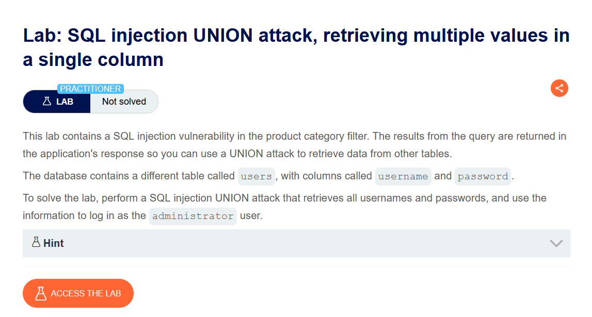
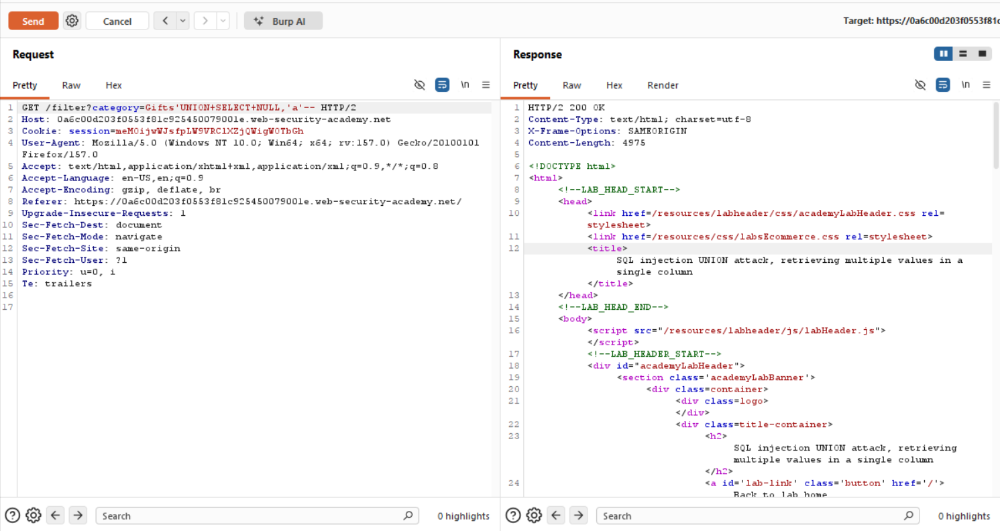
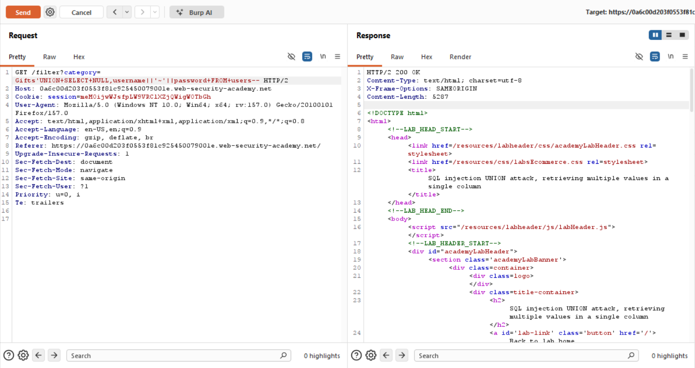
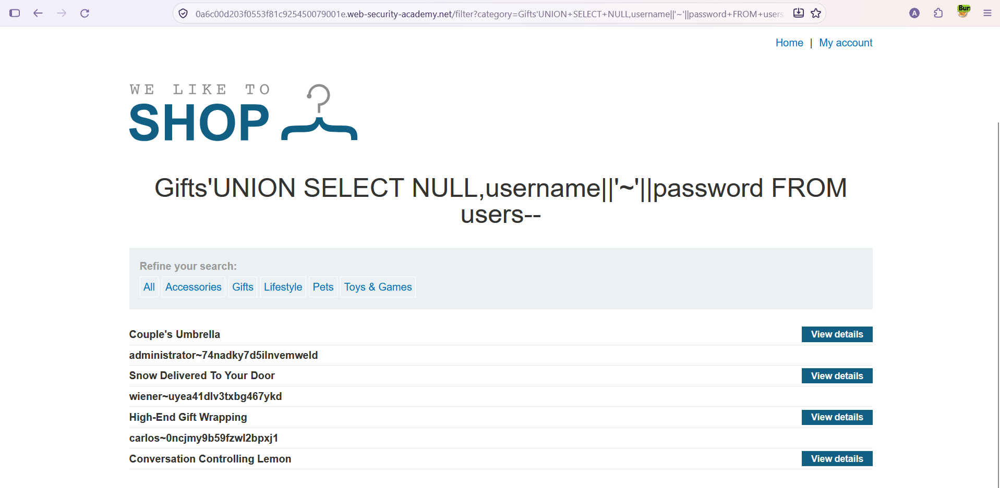
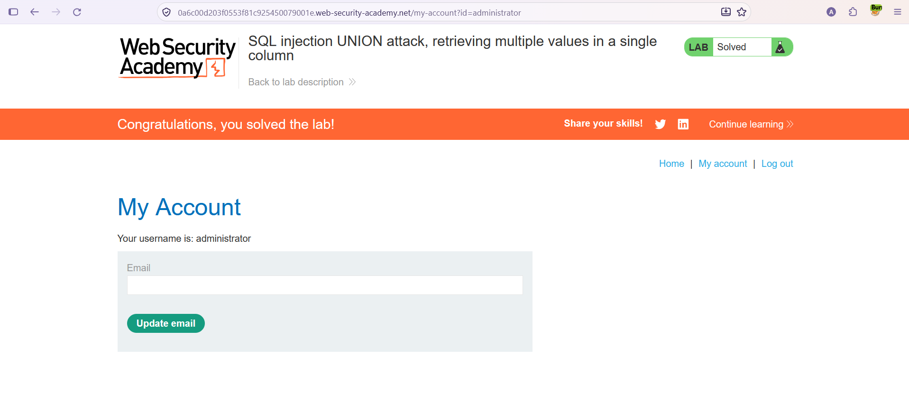

# SQL Injection — UNION Attack: Tek Sütunda Birden Fazla Değer Çekme

**Lab:** SQL injection UNION attack, retrieving multiple values in a single column
**Seviye:** Practitioner
**Kategori:** SQL Injection (UNION)
**Araçlar:** Burp Suite (Proxy + Repeater), tarayıcı
**Lab linki:** https://portswigger.net/web-security/sql-injection/union-attacks/lab-retrieve-multiple-values-in-single-column

---

## Zafiyetin Özeti

Kategori filtresi SQL enjeksiyonuna açık ve sorgu sonuçları sayfada gösteriliyor. `users` tablosunda `username` ve `password` sütunları var. Amaç yine tüm kullanıcı adı/parolaları çekip `administrator` olarak giriş yapmak.

Bu lab'in farkı: orijinal sorgu 2 sütun döndürüyor ama **yalnızca bir sütun metin (text) verisiyle uyumlu**. Oysa biz iki ayrı bilgi (`username` + `password`) çekmek istiyoruz. Çözüm: iki değeri **tek bir string içinde birleştirmek** (string concatenation).

## Lab Açıklaması



## Çözüm Adımları

### 1. Sütun sayısı ve metin sütununu belirlemek

İsteği Burp Repeater'a gönderip test ediyoruz:

```
Gifts' UNION SELECT NULL,'a'--
```

Yanıt `200 OK`. Buradan iki şeyi öğreniyoruz: sorgu **2 sütun** döndürüyor ve metin basabileceğimiz sütun **2. sütun** (1. sütun `NULL`, metin kabul etmiyor).



Yani çatımız şu: `UNION SELECT NULL, <buraya tek bir metin>`. Elimizde metin basacak **tek bir yer** var, ama çekmek istediğimiz veri **iki parça**.

### 2. İki değeri tek sütunda birleştirmek

İki parçayı birleştirip araya bir ayraç koyarak tek string haline getiriyoruz:

```
Gifts' UNION SELECT NULL,username||'~'||password FROM users--
```

Yanıt `200 OK`; `users` tablosundaki satırlar `kullaniciadi~parola` biçiminde sonuçlara ekleniyor.



### 3. Sonuçları tarayıcıda görüntülemek

Aynı payload'ı tarayıcıda URL üzerinden çalıştırıyoruz:

```
/filter?category=Gifts'+UNION+SELECT+NULL,username||'~'||password+FROM+users--
```

Kullanıcı adı ve parolalar `administrator~...` biçiminde listeleniyor.



### 4. administrator olarak giriş yapmak

`~` ayracı sayesinde `administrator` kullanıcı adını ve parolasını net biçimde ayırıp giriş formundan oturum açıyoruz. Lab çözülmüş olarak işaretleniyor.



## Neden `username || '~' || password`? (İşin Mantığı)

Bu payload'ın şekli rastgele değil; tamamen önceki adımda bulduğumuz kısıttan doğuyor: **kaç sütun var + hangileri metin kabul ediyor.**

### `||` neden kullanılıyor?

`||`, bir **string birleştirme (concatenation)** operatörüdür. Oracle, PostgreSQL ve SQLite gibi veritabanlarında iki metni yan yana ekler:

```
'abc' || 'def'   →   'abcdef'
```

### Neden iki değeri tek sütunda birleştiriyoruz?

İşin özü burası. 1. adımda şunu tespit ettik: sorgu 2 sütun döndürüyor ama bunlardan yalnızca 1'i metin tutabiliyor. Biz ise `username` ve `password` olmak üzere iki ayrı bilgi istiyoruz. Metin basabileceğimiz tek bir sütun olduğundan, iki değeri iki ayrı sütuna koyamayız (diğer sütun `NULL`, metin kabul etmiyor). Bu yüzden ikisini birleştirip tek bir string yapıyoruz:

```
username || password
```

### `'~'` neden var?

Sadece `username || password` yapsaydık çıktı şöyle olurdu:

```
administrator74nadky7d5ilnvemweld
```

Kullanıcı adının nerede bitip parolanın nerede başladığını gözle ayıramazdık. Bu yüzden araya bir **ayraç (separator)** koyuyoruz:

```
username || '~' || password   →   administrator~74nadky7d5ilnvemweld
```

Artık çıktı net:

```
administrator~74nadky7d5ilnvemweld
wiener~uyea41dlv3txbg467ykd
carlos~0ncjmy9b59fzwl2bpxj1
```

`~` seçilmesinin özel bir sebebi yok — kullanıcı adı ve parolalarda neredeyse hiç geçmeyen, gözle kolay fark edilen bir karakter olduğu için tercih edilir. `:`, `|`, `#` gibi başka bir ayraç da olurdu.

### "Bu formatı nasıl bildik?"

Formatı belirleyen tek şey şu kısıttı: **kaç sütun + hangileri metin.** Bunu `UNION SELECT NULL,'a'--` denemesiyle öğrendik:

- `NULL` → 1. sütun (metin basılamıyor)
- `'a'` → 2. sütun (metin basılabiliyor ✓)

Çatı belli: `UNION SELECT NULL, <tek bir metin>`. Çekmek istediğimiz veri iki parça, yerimiz tek; o yüzden `||` ile birleştirip `~` ile ayırıyoruz. Mantık hep aynı: **eldeki sütun sayısına veriyi sığdırmak.**

### DBMS notu

Bu payload Oracle / PostgreSQL / SQLite içindir; bu veritabanlarında `||` string birleştirmedir. **MySQL**'de `||` varsayılan olarak mantıksal `OR` anlamına gelir ve bu şekilde çalışmaz; orada `CONCAT(username,'~',password)` kullanılır. Hangi DBMS olduğu da genelde bu tür denemelerle anlaşılır.

## Önlem

- **Parametreli sorgular (prepared statements):** Kullanıcı girdisi sorguya birleştirilmemeli; böylece `UNION SELECT` ve concatenation enjekte edilemez.
- **Girdi doğrulama (allow-list):** `category` yalnızca bilinen değerlere karşı doğrulanmalı.
- **Parolaların güvenli saklanması:** Parolalar güçlü bir hash algoritmasıyla (ör. bcrypt) saklanmalı.
- **En az yetki prensibi:** Uygulamanın veritabanı kullanıcısı yalnızca gereken tablolara erişebilmeli.
