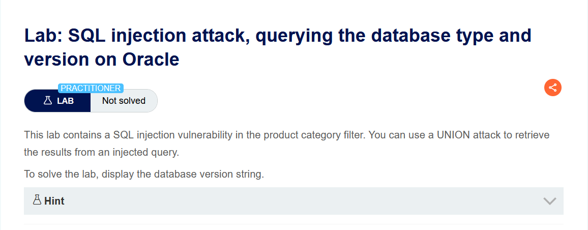
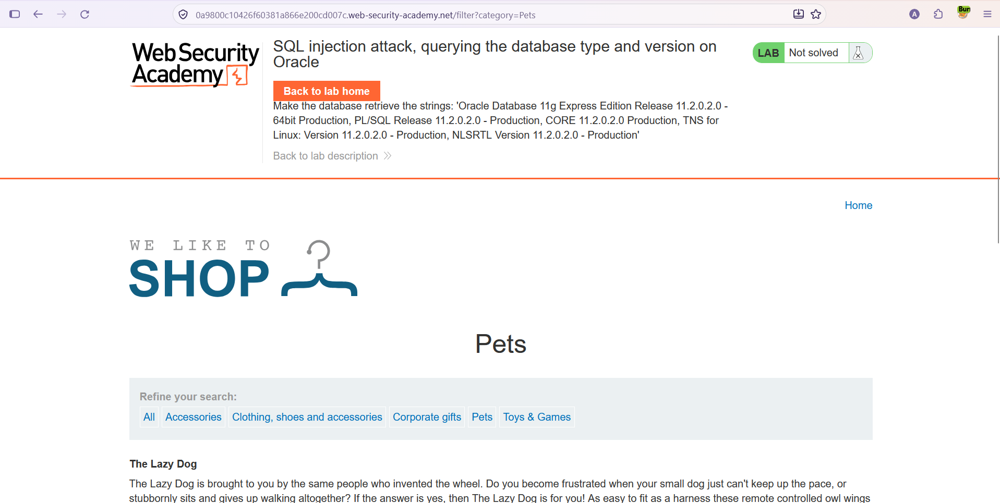
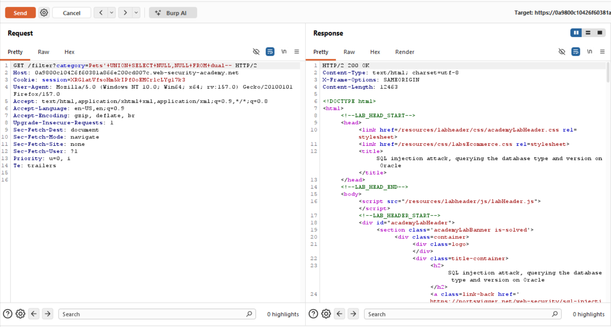
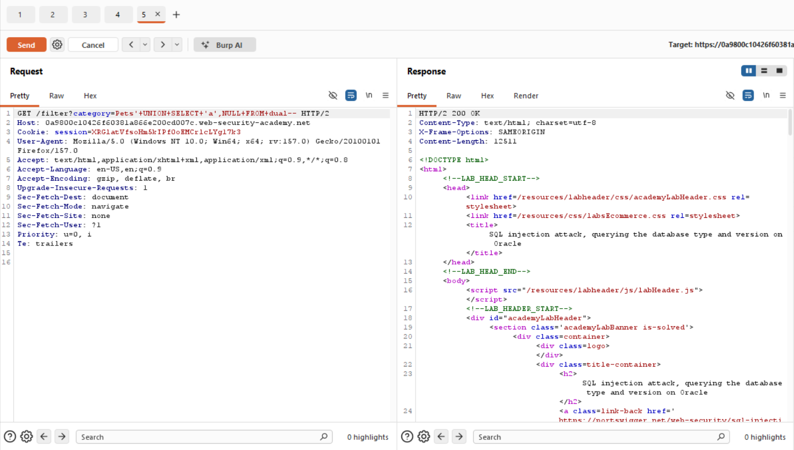
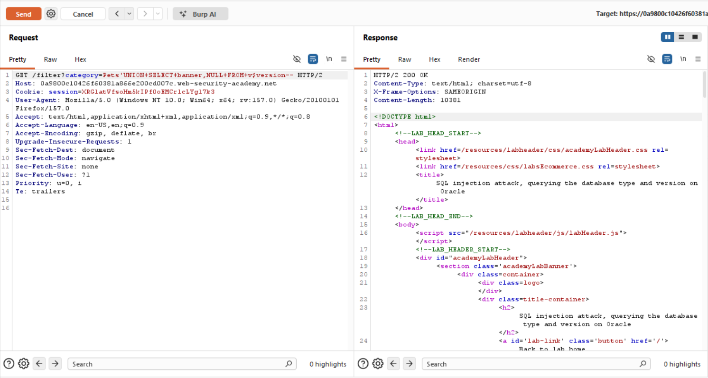
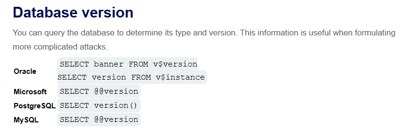

# SQL Injection — Veritabanı Tipi ve Versiyonunu Sorgulama (Oracle)

**Lab:** SQL injection attack, querying the database type and version on Oracle
**Seviye:** Practitioner
**Kategori:** SQL Injection (UNION / bilgi toplama)
**Araçlar:** Burp Suite (Proxy + Repeater), tarayıcı
**Lab linki:** https://portswigger.net/web-security/sql-injection/examining-the-database/lab-querying-database-version-oracle

---

## Zafiyetin Özeti

Ürün kategorisi filtresi SQL enjeksiyonuna açık ve sorgu sonuçları sayfada gösteriliyor; bu yüzden `UNION` saldırısıyla enjekte edilen bir sorgunun sonucunu ekrana bastırabiliyoruz. Arka planda muhtemelen şuna benzer bir sorgu çalışıyor:

```sql
SELECT ad, aciklama FROM products WHERE category = 'Gifts'
```

`category` parametresi doğrudan sorguya gömüldüğü için tırnağı kapatıp kendi SQL'imizi ekleyebiliyoruz. Amaç: veritabanının **versiyon string'ini** ekrana getirmek.

Bu lab özellikle **Oracle** üzerinde. Oracle'ı diğer veritabanlarından ayıran iki belirgin özellik bu çözümde öne çıkıyor: `FROM dual` zorunluluğu ve `v$version` görünümü.

## Lab Açıklaması



## Çözüm Adımları

### 1. Hedef string ve normal sayfa

Lab, veritabanına şu metinleri getirtmemizi istiyor: `Oracle Database 11g Express Edition Release 11.2.0.2.0 - 64bit Production, ...`. Normal "Pets" sayfası görüntülendiğinde lab henüz çözülmemiş.



### 2. Sütun sayısını bulmak (Oracle: `FROM dual`)

UNION saldırısının çalışması için enjekte ettiğimiz `SELECT`, orijinal sorguyla **aynı sayıda sütun** döndürmeli. İsteği Burp Repeater'a gönderip test ediyoruz:

```
Pets' UNION SELECT NULL,NULL FROM dual--
```

Yanıt `200 OK`. Demek ki sorgu **2 sütun** döndürüyor.



Buradaki Oracle'a özgü nokta `FROM dual`: Oracle'da `FROM` olmadan `SELECT` yazılamaz. `dual`, tam da bu iş için var olan tek satırlık sahte (dummy) bir sistem tablosudur. MySQL/MSSQL'de buna gerek yoktur; bu zorunluluk, hedefin Oracle olduğunu gösteren en belirgin ipuçlarından biridir.

- Baştaki `'` orijinal `category='...'` tırnağını kapatır.
- `--` kalan SQL'i yorum satırına çevirir, böylece orijinal sorgunun artığı hata vermez.
- (URL'deki `+` işaretleri boşluk yerine geçer, çünkü payload bir query parametresinde gönderiliyor.)

### 3. Metin sütununu doğrulamak

Versiyon string'i metin olduğu için, metin basabileceğimiz bir sütun olduğundan emin oluyoruz:

```
Pets' UNION SELECT 'a',NULL FROM dual--
```

Yanıt `200 OK`; 1. sütun metin verisiyle uyumlu.



### 4. Versiyonu okumak (`v$version`)

Metin basabileceğimizi doğruladıktan sonra, versiyon bilgisini çekiyoruz:

```
Pets' UNION SELECT banner,NULL FROM v$version--
```

- `v$version`, Oracle'ın sürüm bilgisini satırlar halinde tutan bir sistem görünümüdür (view).
- `banner` sütunu insan tarafından okunabilir sürüm metnini içerir ("Oracle Database 11g ...").
- 1. sütuna `banner`, 2. sütuna `NULL` koyarız; 2. sütunun değerine ihtiyacımız yok ama sütun sayısı yine 2 olmak zorunda. `NULL` her tiple uyumlu olduğu için güvenli bir dolgudur.

Yanıt `200 OK` dönüyor; versiyon string'i ürün listesinin arasında sayfaya ekleniyor ve lab çözülmüş olarak işaretleniyor.



## Neden Oracle'a Özgü?

Versiyon bilgisini almak her veritabanında farklıdır. Bu lab'de hedefin Oracle olduğunu iki ipucundan anlıyoruz: `FROM dual` zorunluluğu ve `v$version` görünümü. DBMS'e göre versiyon sorguları:

| DBMS | Versiyon sorgusu |
|------|------------------|
| Oracle | `SELECT banner FROM v$version` veya `SELECT version FROM v$instance` |
| Microsoft (MSSQL) | `SELECT @@version` |
| PostgreSQL | `SELECT version()` |
| MySQL | `SELECT @@version` |



Pratikte hangi DBMS olduğu da genelde bu tür denemelerle anlaşılır: `FROM dual` gerektirmesi Oracle'a, `||` yerine `CONCAT` gerektirmesi MySQL'e işaret eder gibi.

## Neden Bilgi Toplama Önemli?

Veritabanının tipini ve sürümünü bilmek, sonraki adımlarda doğru söz dizimini ve bilinen zafiyetleri seçmek için gereklidir. UNION payload'larının söz dizimi (ör. `FROM dual`, sistem görünümlerinin adları, string birleştirme operatörleri) DBMS'e göre değiştiğinden, saldırının geri kalanı bu bilgiye dayanır.

## Önlem

- **Parametreli sorgular (prepared statements):** Kullanıcı girdisi sorguya birleştirilmemeli; böylece `UNION SELECT` enjekte edilemez.
- **Girdi doğrulama (allow-list):** `category` yalnızca bilinen değerlere karşı doğrulanmalı.
- **Ayrıntılı hata ve çıktıların gizlenmesi:** Sorgu sonuçlarının ve hata mesajlarının kullanıcıya yansıtılması, versiyon gibi bilgilerin sızmasını kolaylaştırır. (Tek başına yeterli değildir; asıl çözüm parametreli sorgulardır.)
- **En az yetki prensibi:** Uygulamanın veritabanı kullanıcısı sistem görünümlerine (ör. `v$version`) gereksiz yere erişebilmemeli.
