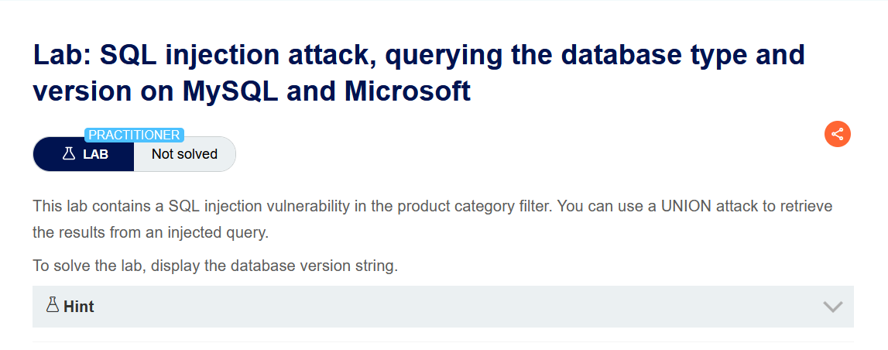
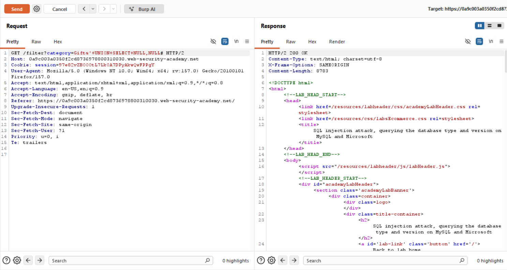
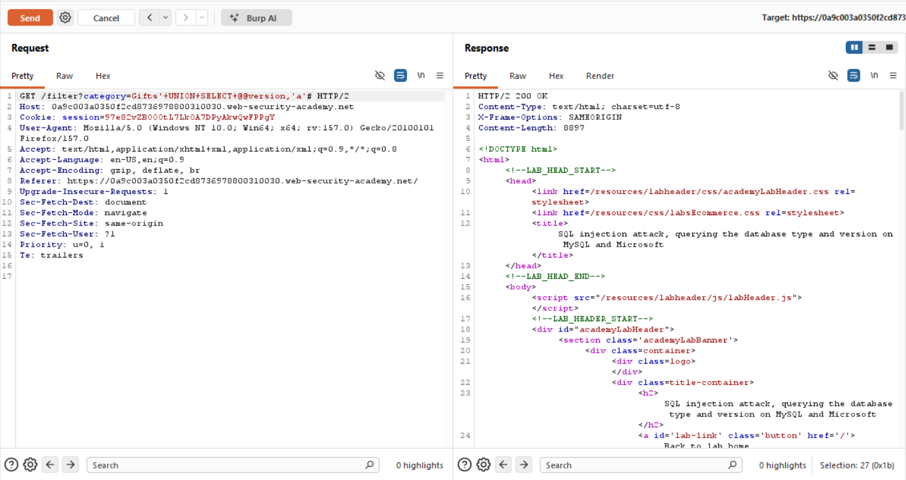
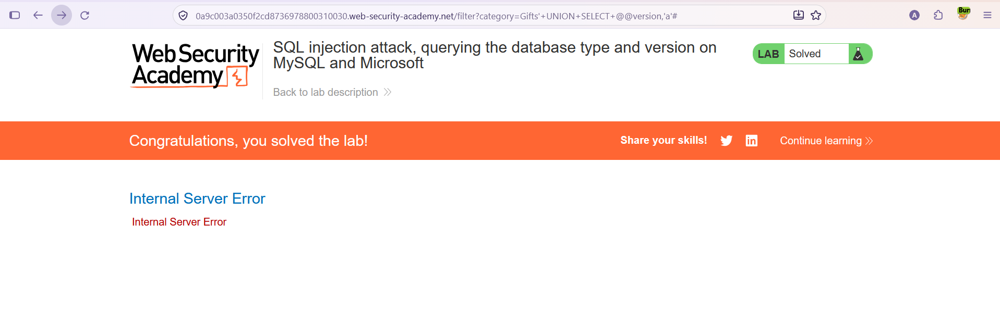

# SQL Injection — Veritabanı Tipi ve Versiyonunu Sorgulama (MySQL ve Microsoft)

**Lab:** SQL injection attack, querying the database type and version on MySQL and Microsoft
**Seviye:** Practitioner
**Kategori:** SQL Injection (UNION / bilgi toplama)
**Araçlar:** Burp Suite (Proxy + Repeater), tarayıcı
**Lab linki:** https://portswigger.net/web-security/sql-injection/examining-the-database/lab-querying-database-version-mysql-microsoft

---

## Zafiyetin Özeti

Ürün kategorisi filtresi SQL enjeksiyonuna açık ve enjekte edilen sorgunun sonucu sayfada gösteriliyor; bu yüzden `UNION` saldırısıyla veritabanının **versiyon string'ini** ekrana bastırabiliyoruz. Amaç: versiyon bilgisini görüntülemek.

Bu lab bir önceki Oracle lab'inin MySQL/Microsoft (MSSQL) karşılığıdır. Söz dizimi iki yerde değişir: yorum karakteri ve versiyon fonksiyonu.

## Lab Açıklaması



## MySQL/MSSQL'de Söz Dizimi Farkları

- **Yorum karakteri `#`:** MySQL'de satır yorumu `#` ile yapılır. (Oracle/PostgreSQL/MSSQL'de `--` kullanılır; MySQL'de `--` kullanılacaksa sonrasında bir boşluk gerekir: `-- `. Bu yüzden MySQL'de `#` daha pratiktir.) URL'de gönderildiğinde `#` tarayıcı tarafından fragment olarak yorumlanmasın diye, Repeater'da ham istekte doğrudan kullanılır.
- **`FROM` gerekmez:** Oracle'daki `FROM dual` zorunluluğu burada yoktur; `SELECT` doğrudan `FROM` olmadan yazılabilir.
- **Versiyon fonksiyonu `@@version`:** Hem MySQL hem de Microsoft (MSSQL) için sürüm bilgisi `@@version` ile alınır.

## Çözüm Adımları

### 1. Sütun sayısını bulmak

İsteği Burp Repeater'a gönderip sütun sayısını test ediyoruz (yorum karakteri olarak `#`):

```
Gifts' UNION SELECT NULL,NULL#
```

Yanıt `200 OK`. Sorgu **2 sütun** döndürüyor.



- Baştaki `'` orijinal `category='...'` tırnağını kapatır.
- `#` kalan SQL'i yorum satırına çevirir.

### 2. Versiyonu okumak (`@@version`)

İki sütundan birine versiyon bilgisini, diğerine dolgu olarak metin koyuyoruz:

```
Gifts' UNION SELECT @@version,'a'#
```

- `@@version`, MySQL ve MSSQL'de sürüm bilgisini döndüren bir sistem değişkenidir.
- 2. sütuna `'a'` koyulur çünkü değerine ihtiyaç yok ama sütun sayısı yine 2 olmak zorunda. (Versiyon string'inin tutulacağı sütun metin kabul ettiği için `'a'` de metin verilmiştir.)

Yanıt `200 OK` dönüyor; versiyon string'i sayfaya ekleniyor ve lab çözülmüş olarak işaretleniyor.



> Not: Versiyonu alma yöntemini (DBMS'e göre `@@version` / `version()` / `v$version`) bir SQLi cheat sheet'inden referans alarak uyguladım.

### 3. Sonuç

Payload gönderildiğinde lab "Solved" durumuna geçiyor.



## DBMS'e Göre Versiyon Sorguları

| DBMS | Versiyon sorgusu | Yorum karakteri | Not |
|------|------------------|-----------------|-----|
| MySQL | `SELECT @@version` | `#` veya `-- ` (boşluklu) | `FROM` gerekmez |
| Microsoft (MSSQL) | `SELECT @@version` | `--` | `FROM` gerekmez |
| Oracle | `SELECT banner FROM v$version` | `--` | `FROM dual` zorunlu |
| PostgreSQL | `SELECT version()` | `--` | — |

Pratikte hangi DBMS olduğu da bu tür denemelerle anlaşılır: `#` yorumunun ve `@@version`'ın çalışması MySQL'e (ya da MSSQL'e) işaret eder; `FROM dual` gerekmesi Oracle'a.

## Önlem

- **Parametreli sorgular (prepared statements):** Kullanıcı girdisi sorguya birleştirilmemeli; böylece `UNION SELECT` enjekte edilemez.
- **Girdi doğrulama (allow-list):** `category` yalnızca bilinen değerlere karşı doğrulanmalı.
- **Ayrıntılı hata ve çıktıların gizlenmesi:** Sorgu sonuçlarının kullanıcıya yansıtılması, versiyon gibi bilgilerin sızmasını kolaylaştırır. (Tek başına yeterli değildir; asıl çözüm parametreli sorgulardır.)
