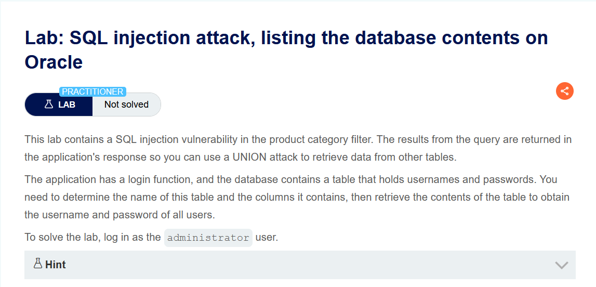
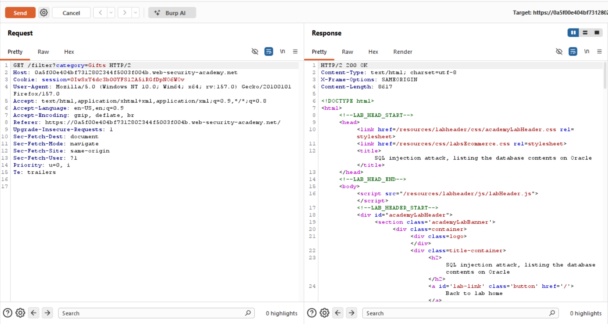
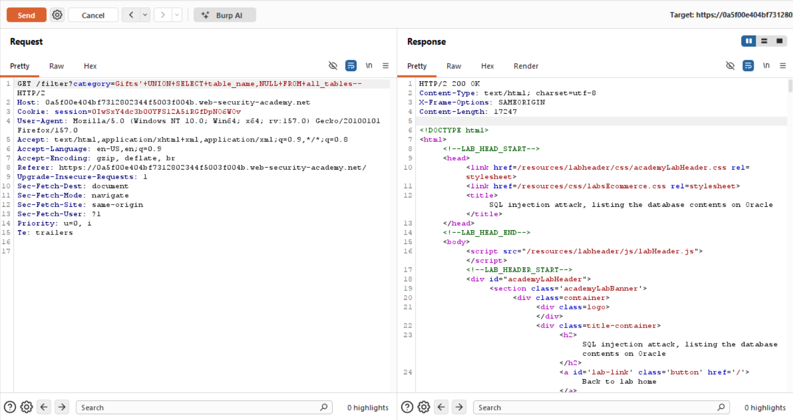
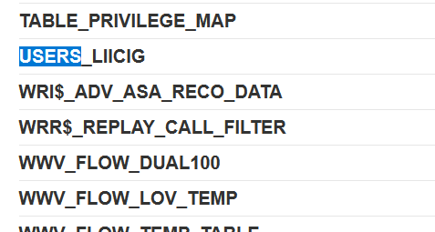
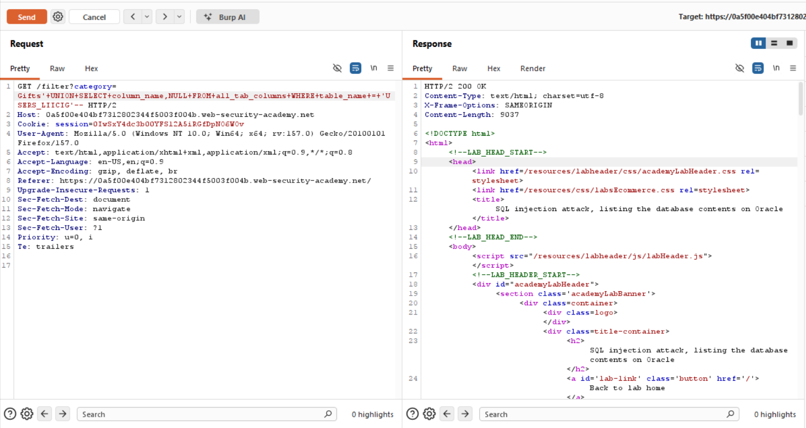
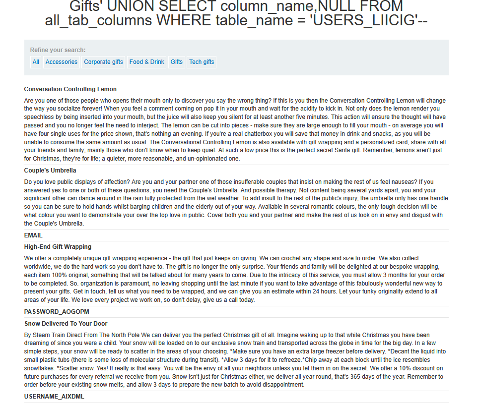
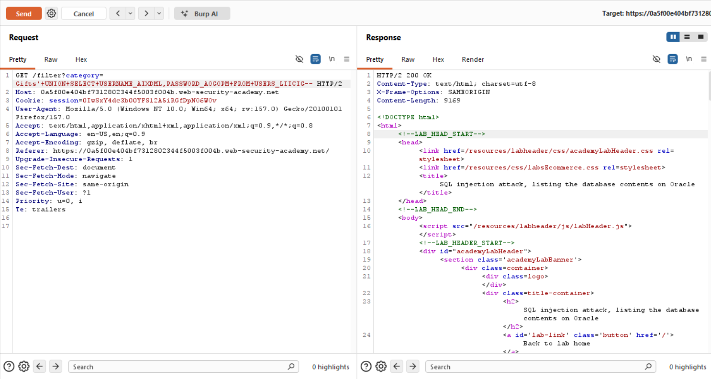
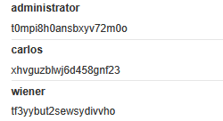
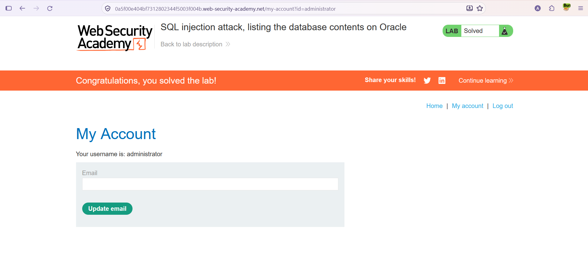

# SQL Injection — Veritabanı İçeriğini Listeleme (Oracle)

**Lab:** SQL injection attack, listing the database contents on Oracle
**Seviye:** Practitioner
**Kategori:** SQL Injection (UNION / Oracle veri sözlüğü)
**Araçlar:** Burp Suite (Proxy + Repeater), tarayıcı
**Lab linki:** https://portswigger.net/web-security/sql-injection/examining-the-database/lab-listing-database-contents-oracle

---

## Zafiyetin Özeti

Ürün kategorisi filtresi SQL enjeksiyonuna açık ve sorgu sonuçları sayfada gösteriliyor. Bu lab bir önceki "non-Oracle" lab'inin **Oracle** karşılığıdır: tablo adını ve sütun adlarını bilmiyoruz; önce keşfedip sonra içeriği çekmemiz gerekiyor. Amaç: tüm kullanıcı adı/parolaları alıp `administrator` olarak giriş yapmak.

Farkı şudur: Oracle'da `information_schema` **yoktur**. Meta veri (veri sözlüğü) farklı görünümlerde tutulur:

- `all_tables` → erişilebilir tüm tabloların adları (`table_name` sütunu).
- `all_tab_columns` → tüm sütunların adları (`column_name`), hangi tabloya ait olduğu (`table_name`) bilgisiyle.

Ayrıca Oracle'da her `SELECT` bir `FROM` gerektirir (bkz. Oracle versiyon lab'indeki `FROM dual`).

## Lab Açıklaması



## Çözüm Adımları

### 1. Normal istek

İsteği Burp Repeater'a gönderip normal `GET /filter?category=Gifts` yanıtını inceliyoruz.



### 2. Tabloları listelemek

Tablo adlarını Oracle'ın `all_tables` görünümünden çekiyoruz:

```
Gifts' UNION SELECT table_name,NULL FROM all_tables--
```

Sonuçta erişilebilir tüm tablolar listeleniyor (Oracle'ın `WWV_FLOW_*`, `WRI$_*` gibi sistem tabloları da görünüyor — bu adlandırma hedefin Oracle olduğunu doğrular).



Listede kullanıcı bilgilerini tutan tabloyu buluyoruz: **`USERS_LIICIG`**. (Tablo adı her oturumda rastgele bir son ek alır.)



### 3. Sütun adlarını listelemek

`USERS_LIICIG` tablosunun sütun adlarını `all_tab_columns` görünümünden, ilgili tabloya filtreleyerek çekiyoruz:

```
Gifts' UNION SELECT column_name,NULL FROM all_tab_columns WHERE table_name='USERS_LIICIG'--
```



Sonuçta kullanıcı adı ve parola sütunlarının adlarını öğreniyoruz: **`USERNAME_AIXDML`** ve **`PASSWORD_AOGOPM`**.



### 4. Veriyi çekmek

Tablo ve sütun adlarını bildiğimize göre kullanıcı adı ve parolaları çekiyoruz:

```
Gifts' UNION SELECT USERNAME_AIXDML,PASSWORD_AOGOPM FROM USERS_LIICIG--
```



Çekilen kimlik bilgileri arasında `administrator` kullanıcısının parolası da var:



### 5. administrator olarak giriş yapmak

`administrator` kullanıcı adı ve parolasıyla giriş formundan oturum açıyoruz; lab çözülmüş olarak işaretleniyor.



## Oracle vs. non-Oracle — Meta Veri Karşılaştırması

| Amaç | non-Oracle (PostgreSQL/MySQL/MSSQL) | Oracle |
|------|--------------------------------------|--------|
| Tabloları listele | `SELECT table_name FROM information_schema.tables` | `SELECT table_name FROM all_tables` |
| Sütunları listele | `SELECT column_name FROM information_schema.columns WHERE table_name='...'` | `SELECT column_name FROM all_tab_columns WHERE table_name='...'` |
| `FROM` zorunluluğu | Gerekmez | Her `SELECT` için gerekir (`dual` dahil) |

Mantık her iki durumda da aynıdır: önce tablo adını, sonra o tablonun sütun adlarını veri sözlüğünden öğren, ardından gerçek veriyi çek. Yalnızca kullanılan görünümlerin adları DBMS'e göre değişir.

## Önlem

- **Parametreli sorgular (prepared statements):** Kullanıcı girdisi sorguya birleştirilmemeli; böylece `UNION SELECT ... FROM all_tables` gibi ifadeler enjekte edilemez.
- **Girdi doğrulama (allow-list):** `category` yalnızca bilinen değerlere karşı doğrulanmalı.
- **Parolaların güvenli saklanması:** Parolalar güçlü bir hash algoritmasıyla (ör. bcrypt) saklanmalı.
- **En az yetki prensibi:** Uygulamanın veritabanı kullanıcısı veri sözlüğü görünümlerine (`all_tables`, `all_tab_columns`) ve hassas tablolara gereksiz erişime sahip olmamalı.
